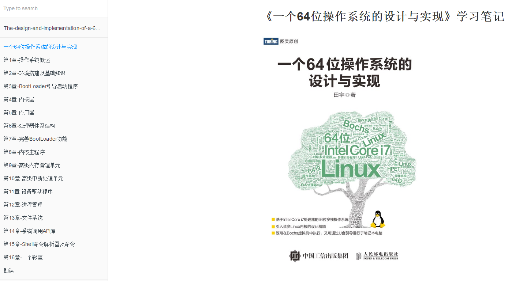

# 《一个64位操作系统的设计与实现》学习笔记


## 该书简介

本书讲述了一个64位多核操作系统的自制过程。此操作系统自制过程是先从虚拟平台构筑起一个基础框架，随后再将基础框架移植到物理平台中进行升级、完善与优化。为了凸显64位多核操作系统的特点，物理平台选用搭载着**Intel Core-i7**处理器的笔记本电脑。与此同时，本书还将Linux内核的源码精髓、诸多官方白皮书以及多款常用协议浓缩于其中，可使读者在读完本书后能够学以致用，进而达到理论联系实际的目的。

本书既适合在校学习理论知识的初学者，又适合在职工作的软件工程师或有一定基础的业余爱好者。

```
  出版日期2018-05-31
  书　　号978-7-115-47525-1
  定　　价139.00元(死贵 =_=! good angry a~)
  页　　数680
```

## 作者简介


一个执着研究操作系统内核的骨灰级程序员，希望在这里找到可以一起讨论的朋友，共同进步。

如果有可能，为什么我们不做一个中国版的linux呢？

这就是我写《一个64位操作系统的实现》的初衷。不求改变世界，但求，可以帮助在学习《操作系统》这门课程上艰难前行的同志们。

**失败不可怕，害怕失败才真正可怕；当你意识到失败只是弯路，那么你就已经走在成功的直道上了。**

## 该书特点

1. 基于Intel Core i7处理器的64位多核操作系统
2. 引入诸多Linux内核的设计精髓
3. 既可在Bochs虚拟机中执行，又可通过U盘引导运行于笔记本电脑

## 目录
```
第1章　操作系统概述
第2章　环境搭建及基础知识
第3章　BootLoader引导启动程序
第4章　内核层
第5章　应用层　
第6章　处理器体系结构
第7章　完善BootLoader功能
第8章　内核主程序
第9章　高级内存管理单元　
第10章　高级中断处理单元
第11章　设备驱动程序
第12章　进程管理
第13章　文件系统
第14章　系统调用API库
第15章　Shell命令解析器及命令
第16章　一个彩蛋
```
## 技术交流


      欢迎加入技术讨论~
      可以在issue提问~

## 相关情报站点

[GitHub](https://github.com/yifengyou/The-design-and-implementation-of-a-64-bit-operating-system)


[GitBook读书笔记](https://yifengyou.gitbooks.io/the-design-and-implementation-of-a-64-bit-operati/content/)




[图灵社区该书站点](http://www.ituring.com.cn/book/2450)


