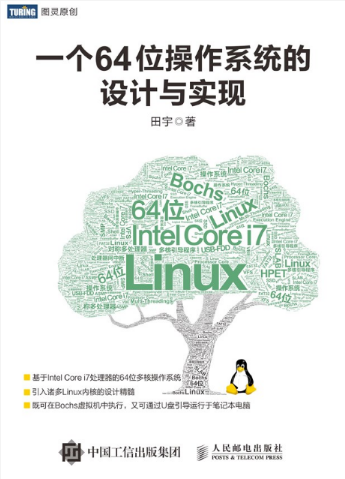

# 《一个64位操作系统的设计与实现》学习笔记



```
工作毕业均落实，书已经阅过，笔记不能落下。持续更新搞事情
```

## 本仓库说明

1. 本仓库代码默认运行环境位CenOS6.4 x64，相关环境搭建参看**《第二章-环境搭建及基础知识》**
2. 尽量做到每个例程用一个run.sh脚本一键运行跑起，目前还在更新中。。随书源码在Mac下开发，乱的一笔，整理一波先。
3. 书才收到没多久，慢慢看，稳稳更新。。
4. 尽可能做到每个实例用脚本启动运行，尽可能添加注释

```
Something I hope you know before go into the coding~
* First, please watch or star this repo, I'll be more happy if you follow me.
* Bug report, questions and discussion are welcome, you can post an issue or pull a request.
```

## 相关情报站点

1. 本仓库已经开始作为gitbook仓库，访问地址

<https://yifengyou.gitbooks.io/the-design-and-implementation-of-a-64-bit-os>


2. GitHub仓库地址

<https://github.com/yifengyou/The-design-and-implementation-of-a-64-bit-os>

3. 图灵社区该书介绍站点

<http://www.ituring.com.cn/book/2450>


## 该书简介

本书讲述了一个64位多核操作系统的自制过程。此操作系统自制过程是先从虚拟平台构筑起一个基础框架，随后再将基础框架移植到物理平台中进行升级、完善与优化。为了凸显64位多核操作系统的特点，物理平台选用搭载着**Intel Core-i7**处理器的笔记本电脑。与此同时，本书还将Linux内核的源码精髓、诸多官方白皮书以及多款常用协议浓缩于其中，可使读者在读完本书后能够学以致用，进而达到理论联系实际的目的。

本书既适合在校学习理论知识的初学者，又适合在职工作的软件工程师或有一定基础的业余爱好者。

## 作者简介


一个执着研究操作系统内核的骨灰级程序员，希望在这里找到可以一起讨论的朋友，共同进步。

如果有可能，为什么我们不做一个中国版的linux呢？

这就是我写《一个64位操作系统的实现》的初衷。不求改变世界，但求，可以帮助在学习《操作系统》这门课程上艰难前行的同志们。

**失败不可怕，害怕失败才真正可怕；当你意识到失败只是弯路，那么你就已经走在成功的直道上了。**

## 该书特点

1. 基于Intel Core i7处理器的64位多核操作系统
2. 引入诸多Linux内核的设计精髓
3. 既可在Bochs虚拟机中执行，又可通过U盘引导运行于笔记本电脑

## 目录

* [一个64位操作系统的设计与实现](README.md)
* [第1章-操作系统概述](docs/第1章-操作系统概述/第1章-操作系统概述.md)
* [第2章-环境搭建及基础知识](docs/第2章-环境搭建及基础知识/第2章-环境搭建及基础知识.md)
* [第3章-BootLoader引导启动程序](docs/第3章-BootLoader引导启动程序/第3章-BootLoader引导启动程序.md)
* [第4章-内核层](docs/第4章-内核层/第4章-内核层.md)
* [第5章-应用层](docs/第5章-应用层/第5章-应用层.md)
* [第6章-处理器体系结构](docs/第6章-处理器体系结构/第6章-处理器体系结构.md)
* [第7章-完善BootLoader功能](docs/第7章-完善BootLoader功能/第7章-完善BootLoader功能.md)
* [第8章-内核主程序](docs/第8章-内核主程序/第8章-内核主程序.md)
* [第9章-高级内存管理单元](docs/第9章-高级内存管理单元/第9章-高级内存管理单元.md)
* [第10章-高级中断处理单元](docs/第10章-高级中断处理单元/第10章-高级中断处理单元.md)
* [第11章-设备驱动程序](docs/第11章-设备驱动程序/第11章-设备驱动程序.md)
* [第12章-进程管理](docs/第12章-进程管理/第12章-进程管理.md)
* [第13章-文件系统](docs/第13章-文件系统/第13章-文件系统.md)
* [第14章-系统调用API库](docs/第14章-系统调用API库/第14章-系统调用API库.md)
* [第15章-Shell命令解析器及命令](docs/第15章-Shell命令解析器及命令/第15章-Shell命令解析器及命令.md)
* [第16章-一个彩蛋](docs/第16章-一个彩蛋/第16章-一个彩蛋.md)
* [勘误](docs/勘误/勘误.md)
* [吐槽大会](docs/吐槽大会/吐槽大会.md)
* [Linux内核模型机-演示内核工作原理](docs/Linux内核模型机-演示内核工作原理/Linux内核模型机-演示内核工作原理.md)
* [操作系统为什么那么难](docs/操作系统为什么那么难/操作系统为什么那么难.md)
* [内存管理为什么那么难](docs/内存管理为什么那么难/内存管理为什么那么难.md)
* [如何降低OS入门门槛](docs/如何降低OS入门门槛/如何降低OS入门门槛.md)

## 技术交流

### QQ群：144571173


* 《一个64位操作系统的设计与实现》交流群
* 群主即为该书作者，有问题直接怼他就行
* 不需要添加好友瞎逼逼

### QQ群：148177180


* 《操作系统真象还原》交流群

### QQ群：361934810


* 《大话计算机》交流群
