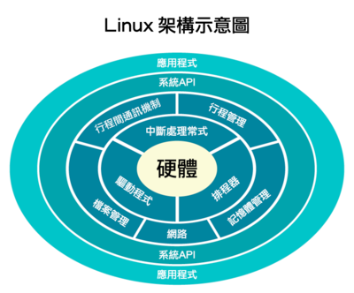

# 第1章-操作系统概述

## 操作系统定义

来自维基百科：

```
操作系统（英语：Operating System，缩写：OS）是管理计算机硬件与软件资源的系统软件，同时也是计算机系统的内核与基石。操作系统需要处理如管理与配置内存、决定系统资源供需的优先次序、控制输入与输出设备、操作网络与管理文件系统等基本事务。操作系统也提供一个让用户与系统交互的操作界面。

操作系统的类型非常多样，不同机器安装的操作系统可从简单到复杂，可从移动电话的嵌入式系统到超级计算机的大型操作系统。许多操作系统制造者对它涵盖范畴的定义也不尽一致，例如有些操作系统集成了图形用户界面，而有些仅使用命令行界面，而将图形用户界面视为一种非必要的应用程序。

操作系统理论在计算机科学中，为历史悠久而又活跃的分支；而操作系统的设计与实现则是软件工业的基础与内核。
```




## 其他

1. 编写一个操作系统必备知识并不多，只需要掌握汇编语言和C语言，以及能看懂**硬件电路图**和芯片手册即可。难点在于如何高效运行。
2. Bochs虚拟软件可用内存上限为2GB。书中咋不讲bximage？P36提到
