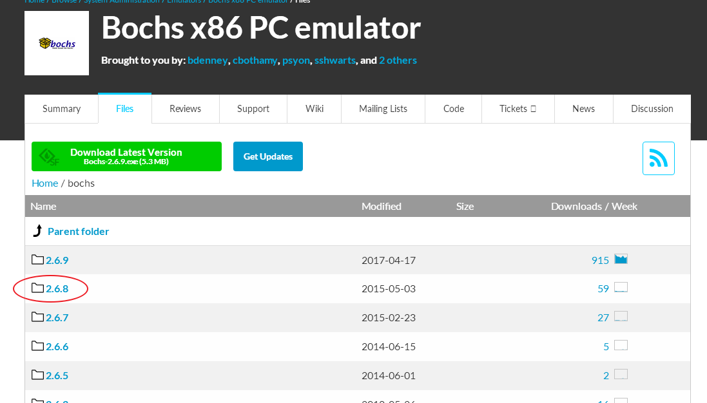
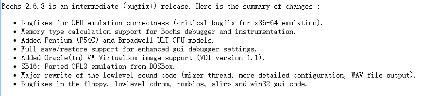
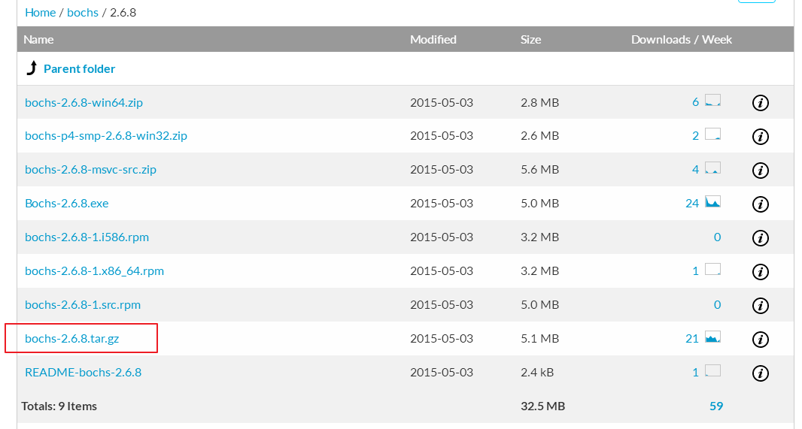
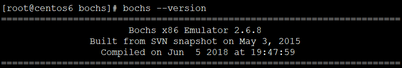
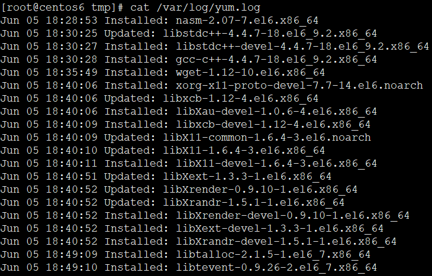

<!-- TOC depthFrom:1 depthTo:6 withLinks:1 updateOnSave:1 orderedList:0 -->

- [第2章-环境搭建及基础知识](#第2章-环境搭建及基础知识)
	- [bochs环境搭建](#bochs环境搭建)
		- [bochs源码获取](#bochs源码获取)
		- [onkey.sh 一键安装](#onkeysh-一键安装)
		- [默认.bochsrc配置及详细说明](#默认bochsrc配置及详细说明)
	- [bochs使用技巧](#bochs使用技巧)
	- [总结](#总结)

<!-- /TOC -->

# 第2章-环境搭建及基础知识

## bochs环境搭建

1. 必须源码安装，本以为在Ubuntu下使用apt-get一下就ok了，但是书上系统要求比较新，默认apt-get装的比较老旧。再者Ubuntu16 gcc版本启用了堆栈保护，造成第四章编译失败。
2. 经过一番折腾放弃了在Ubuntu16x64上运行，转战CentOS6x64
3. bochs采用Bochs 2.6.8，虽然现在已经Bochs 2.6.9了，不管你信不信，CentOS编译报错了。
4. 依赖问题也蛮多，yum安装一波
4. 再说一遍。本仓库运行环境位CentOS6 64位。踩了几天的坑，笔记也改了多次总结的经验教训。各位看官爱听不听哈，当然大佬除外，所有问题自己改源码解决！

### bochs源码获取



sourceforge站点bochs页面
<https://sourceforge.net/projects/bochs/files/bochs/>
选择2.6.8，跟书上一致，乖乖一致






### onkey.sh 一键安装

本仓库bochs目录下提供源码包以及相关一键执行脚本

			bochs-2.6.8.tar.bz2  distract.sh buildenv.sh

首先运行buildenv.sh安装相关依赖软件包，然后执行distract.sh进行解压，切换到解压文件夹下执行onekey.sh即可完成编译安装



			安装完成后直接运行bochs查看是否配置好环境变量以及版本号是否匹配

PS:如果还有有软件包依赖问题，自行搜索相应包安装即可。



```
./configure --with-x11 --with-wx --enable-debugger --enable-disasm \
 --enable-all-optimizations --enable-readline --enable-long-phy-address \
 --enable-ltdl-install --enable-idle-hack --enable-plugins --enable-a20-pin \
 --enable-x86-64 --enable-smp --enable-cpu-level=6 --enable-large-ramfile \
 --enable-repeat-speedups --enable-fast-function-calls   \
 --enable-handlers-chaining  --enable-trace-linking \
 --enable-configurable-msrs --enable-show-ips --enable-cpp \
 --enable-debugger-gui --enable-iodebug --enable-logging \
 --enable-assert-checks --enable-fpu --enable-vmx=2 --enable-svm \
 --enable-3dnow --enable-alignment-check  --enable-monitor-mwait \
 --enable-avx  --enable-evex --enable-x86-debugger --enable-pci \
 --enable-usb --enable-usb-ohci --enable-usb-ehci   --enable-usb-xhci  \
 --enable-voodoo

```
4. 这里启用功能虽然多，但是还有，具体还有那些可以通过**./configure --help**查看

```
root@ubuntu16x64:~/bochs/bochs# ./configure --help
`configure' configures this package to adapt to many kinds of systems.

Usage: ./configure [OPTION]... [VAR=VALUE]...

To assign environment variables (e.g., CC, CFLAGS...), specify them as
VAR=VALUE.  See below for descriptions of some of the useful variables.

Defaults for the options are specified in brackets.

Configuration:
  -h, --help              display this help and exit
      --help=short        display options specific to this package
      --help=recursive    display the short help of all the included packages
  -V, --version           display version information and exit
  -q, --quiet, --silent   do not print `checking ...' messages
      --cache-file=FILE   cache test results in FILE [disabled]
  -C, --config-cache      alias for `--cache-file=config.cache'
  -n, --no-create         do not create output files
      --srcdir=DIR        find the sources in DIR [configure dir or `..']

Installation directories:
  --prefix=PREFIX         install architecture-independent files in PREFIX
                          [/usr/local]
  --exec-prefix=EPREFIX   install architecture-dependent files in EPREFIX
                          [PREFIX]

By default, `make install' will install all the files in
`/usr/local/bin', `/usr/local/lib' etc.  You can specify
an installation prefix other than `/usr/local' using `--prefix',
for instance `--prefix=$HOME'.

For better control, use the options below.

Fine tuning of the installation directories:
  --bindir=DIR            user executables [EPREFIX/bin]
  --sbindir=DIR           system admin executables [EPREFIX/sbin]
  --libexecdir=DIR        program executables [EPREFIX/libexec]
  --sysconfdir=DIR        read-only single-machine data [PREFIX/etc]
  --sharedstatedir=DIR    modifiable architecture-independent data [PREFIX/com]
  --localstatedir=DIR     modifiable single-machine data [PREFIX/var]
  --libdir=DIR            object code libraries [EPREFIX/lib]
  --includedir=DIR        C header files [PREFIX/include]
  --oldincludedir=DIR     C header files for non-gcc [/usr/include]
  --datarootdir=DIR       read-only arch.-independent data root [PREFIX/share]
  --datadir=DIR           read-only architecture-independent data [DATAROOTDIR]
  --infodir=DIR           info documentation [DATAROOTDIR/info]
  --localedir=DIR         locale-dependent data [DATAROOTDIR/locale]
  --mandir=DIR            man documentation [DATAROOTDIR/man]
  --docdir=DIR            documentation root [DATAROOTDIR/doc/PACKAGE]
  --htmldir=DIR           html documentation [DOCDIR]
  --dvidir=DIR            dvi documentation [DOCDIR]
  --pdfdir=DIR            pdf documentation [DOCDIR]
  --psdir=DIR             ps documentation [DOCDIR]

X features:
  --x-includes=DIR    X include files are in DIR
  --x-libraries=DIR   X library files are in DIR

System types:
  --build=BUILD     configure for building on BUILD [guessed]
  --host=HOST       cross-compile to build programs to run on HOST [BUILD]
  --target=TARGET   configure for building compilers for TARGET [HOST]

Optional Features:
  --disable-option-checking  ignore unrecognized --enable/--with options
  --disable-FEATURE       do not include FEATURE (same as --enable-FEATURE=no)
  --enable-FEATURE[=ARG]  include FEATURE [ARG=yes]
  --enable-static[=PKGS]  build static libraries [default=no]
  --enable-shared[=PKGS]  build shared libraries [default=yes]
  --enable-fast-install[=PKGS]
                          optimize for fast installation [default=yes]
  --disable-libtool-lock  avoid locking (might break parallel builds)
  --enable-ltdl-install   install libltdl
  --disable-largefile     omit support for large files
  --enable-idle-hack      use Roland Mainz's idle hack (no)
  --enable-plugins        enable plugin support (no)
  --enable-a20-pin        compile in support for A20 pin (yes)
  --enable-x86-64         compile in support for x86-64 instructions (no)
  --enable-smp            compile in support for SMP configurations (no)
  --enable-cpu-level      select cpu level (3,4,5,6 - default is 6)
  --enable-long-phy-address
                          compile in support for physical address larger than
                          32 bit (yes, if cpu level >= 5)
  --enable-large-ramfile  enable large ramfile support (yes)
  --enable-repeat-speedups
                          support repeated IO and mem copy speedups (no)
  --enable-fast-function-calls
                          support for fast function calls (no - gcc on x86 and
                          MSVC nmake only)
  --enable-handlers-chaining
                          support handlers-chaining emulation speedups (no)
  --enable-trace-linking  enable trace linking speedups support (no)
  --enable-configurable-msrs
                          support for configurable MSR registers (yes if cpu
                          level >= 5)
  --enable-show-ips       show IPS in Bochs status bar / log file (yes)
  --enable-cpp            use .cpp as C++ suffix (no)
  --enable-debugger       compile in support for Bochs internal debugger (no)
  --enable-disasm         compile in support for disassembler (no)
  --enable-debugger-gui   compile in support for Bochs internal debugger GUI
                          (yes, if debugger is on)
  --enable-gdb-stub       enable gdb stub support (no)
  --enable-iodebug        enable I/O interface to debugger (yes, if debugger
                          is on)
  --enable-all-optimizations
                          compile in all possible optimizations (no)
  --enable-readline       use readline library, if available (no)
  --enable-instrumentation=instrument-dir
                          compile in support for instrumentation (no)
  --enable-logging        enable logging (yes)
  --enable-stats          enable statistics collection (yes)
  --enable-assert-checks  enable BX_ASSERT checks (yes, if debugger is on)
  --enable-fpu            compile in FPU emulation (yes)
  --enable-vmx            VMX (virtualization extensions) emulation
                          (--enable-vmx=[no|1|2])
  --enable-svm            SVM (AMD: secure virtual machine) emulation (no)
  --enable-protection-keys
                          User-Mode Protection Keys support (no)
  --enable-3dnow          3DNow! support (no - incomplete)
  --enable-alignment-check
                          alignment check (#AC) support (yes, if cpu level >
                          3)
  --enable-monitor-mwait  support for MONITOR/MWAIT instructions (yes, if cpu
                          level > 5 - experimental)
  --enable-perfmon        support for limited hardware performance monitoring
                          emulation (yes, if cpu level > 5 - experimental)
  --enable-memtype        support for memory type
  --enable-avx            support for AVX instructions (no)
  --enable-evex           support for EVEX prefix and AVX-512 extensions (no)
  --enable-x86-debugger   x86 debugger support (no)
  --enable-pci            enable i440FX PCI support (yes)
  --enable-pcidev         enable PCI host device mapping support (no - linux
                          host only)
  --enable-usb            enable USB UHCI support (no)
  --enable-usb-ohci       enable USB OHCI support (no)
  --enable-usb-ehci       enable USB EHCI support (no)
  --enable-usb-xhci       enable USB xHCI support (no)
  --enable-ne2000         enable NE2000 support (no)
  --enable-pnic           enable PCI pseudo NIC support (no)
  --enable-e1000          enable Intel(R) Gigabit Ethernet support (no)
  --enable-raw-serial     use raw serial port access (no - incomplete)
  --enable-clgd54xx       enable CLGD54XX emulation (no)
  --enable-voodoo         enable 3dfx Voodoo Graphics emulation (no)
  --enable-cdrom          lowlevel CDROM support (yes)
  --enable-sb16           Sound Blaster 16 Support (no)
  --enable-es1370         enable ES1370 soundcard support (no)
  --enable-gameport       enable standard PC gameport support (yes, if
                          soundcard present)
  --enable-busmouse       enable Busmouse support (InPort & Standard)
  --enable-docbook        build the Docbook documentation (yes, if docbook
                          present)
  --enable-xpm            enable the check for XPM support (yes)

Optional Packages:
  --with-PACKAGE[=ARG]    use PACKAGE [ARG=yes]
  --without-PACKAGE       do not use PACKAGE (same as --with-PACKAGE=no)
  --with-gnu-ld           assume the C compiler uses GNU ld [default=no]
  --with-pic              try to use only PIC/non-PIC objects [default=use
                          both]
  --with-tags[=TAGS]      include additional configurations [automatic]
  --with-x                use the X Window System
  --with-x11                        use X11 GUI
  --with-win32                      use Win32 GUI
  --with-macos                      use Macintosh/CodeWarrior environment
  --with-carbon                     compile for MacOS X with Carbon GUI
  --with-nogui                      no native GUI, just use blank stubs
  --with-term                       textmode terminal environment
  --with-rfb                        use RFB protocol, works with VNC viewer
  --with-vncsrv                     use LibVNCServer, works with VNC viewer
  --with-amigaos                    use AmigaOS (or MorphOS) GUI
  --with-sdl                        use SDL libraries
  --with-sdl2                       use SDL2 libraries
  --with-svga                       use SVGALib libraries
  --with-wx                         use wxWidgets libraries
  --with-all-libs                   compile all guis that Bochs supports

Some influential environment variables:
  CC          C compiler command
  CFLAGS      C compiler flags
  LDFLAGS     linker flags, e.g. -L<lib dir> if you have libraries in a
              nonstandard directory <lib dir>
  LIBS        libraries to pass to the linker, e.g. -l<library>
  CPPFLAGS    (Objective) C/C++ preprocessor flags, e.g. -I<include dir> if
              you have headers in a nonstandard directory <include dir>
  CXX         C++ compiler command
  CXXFLAGS    C++ compiler flags
  CPP         C preprocessor
  CXXCPP      C++ preprocessor
  F77         Fortran 77 compiler command
  FFLAGS      Fortran 77 compiler flags
  XMKMF       Path to xmkmf, Makefile generator for X Window System

Use these variables to override the choices made by `configure' or to help
it to find libraries and programs with nonstandard names/locations.

Report bugs to the package provider.
```

### 默认.bochsrc配置及详细说明

```
  # You may now use double quotes around pathnames, in case
  # your pathname includes spaces.

  #=======================================================================
  # PLUGIN_CTRL:
  # Controls the presence of optional device plugins. These plugins are loaded
  # directly with this option and some of them install a config option that is
  # only available when the plugin device is loaded. The value "1" means to load
  # the plugin and "0" will unload it (if loaded before).
  #
  # These plugins will be loaded by default (if present): 'biosdev', 'extfpuirq',
  # 'gameport', 'iodebug','parallel', 'serial', 'speaker' and 'unmapped'.
  #
  # These plugins are also supported, but they are usually loaded directly with
  # their bochsrc option: 'e1000', 'es1370', 'ne2k', 'pcidev', 'pcipnic', 'sb16',
  # 'usb_ehci', 'usb_ohci', 'usb_uhci', 'usb_xhci' and 'voodoo'.
  #=======================================================================
  #plugin_ctrl: unmapped=0, e1000=1 # unload 'unmapped' and load 'e1000'

  #=======================================================================
  # CONFIG_INTERFACE
  #
  # The configuration interface is a series of menus or dialog boxes that
  # allows you to change all the settings that control Bochs's behavior.
  # Depending on the platform there are up to 3 choices of configuration
  # interface: a text mode version called "textconfig" and two graphical versions
  # called "win32config" and "wx".  The text mode version uses stdin/stdout and
  # is always compiled in, unless Bochs is compiled for wx only. The choice
  # "win32config" is only available on win32 and it is the default there.
  # The choice "wx" is only available when you use "--with-wx" on the configure
  # command.  If you do not write a config_interface line, Bochs will
  # choose a default for you.
  #
  # NOTE: if you use the "wx" configuration interface, you must also use
  # the "wx" display library.
  #=======================================================================
  #config_interface: textconfig
  #config_interface: win32config
  #config_interface: wx

  #=======================================================================
  # DISPLAY_LIBRARY
  #
  # The display library is the code that displays the Bochs VGA screen.  Bochs
  # has a selection of about 10 different display library implementations for
  # different platforms.  If you run configure with multiple --with-* options,
  # the display_library command lets you choose which one you want to run with.
  # If you do not write a display_library line, Bochs will choose a default for
  # you.
  #
  # The choices are:
  #   x              use X windows interface, cross platform
  #   win32          use native win32 libraries
  #   carbon         use Carbon library (for MacOS X)
  #   macintosh      use MacOS pre-10
  #   amigaos        use native AmigaOS libraries
  #   sdl            use SDL 1.2.x library, cross platform
  #   sdl2           use SDL 2.x library, cross platform
  #   svga           use SVGALIB library for Linux, allows graphics without X11
  #   term           text only, uses curses/ncurses library, cross platform
  #   rfb            provides an interface to AT&T's VNC viewer, cross platform
  #   vncsrv         use LibVNCServer for extended RFB(VNC) support
  #   wx             use wxWidgets library, cross platform
  #   nogui          no display at all
  #
  # NOTE: if you use the "wx" configuration interface, you must also use
  # the "wx" display library.
  #
  # Specific options:
  # Some display libraries now support specific options to control their
  # behaviour. These options are supported by more than one display library:
  #
  # "gui_debug"   - use GTK debugger gui (sdl, sdl2, x) / Win32 debugger gui (sdl,
  #                 sdl2, win32)
  # "hideIPS"     - disable IPS output in status bar (rfb, sdl, sdl2, vncsrv,
  #                 win32, wx, x)
  # "nokeyrepeat" - turn off host keyboard repeat (sdl, sdl2, win32, x)
  # "timeout"     - time (in seconds) to wait for client (rfb, vncsrv)
  #
  # See the examples below for other currently supported options.
  #=======================================================================
  #display_library: amigaos
  #display_library: carbon
  #display_library: macintosh
  #display_library: nogui
  #display_library: rfb
  #display_library: sdl, options="fullscreen" # startup in fullscreen mode
  #display_library: sdl2, options="fullscreen" # startup in fullscreen mode
  #display_library: term
  #display_library: vncsrv
  # "traphotkeys" - system hotkeys not handled by host OS, but sent to guest
  #                 (win32 in mouse capture and fullscreen mode: alt-tab, win,
  #                 alt-space, alt-esc, ctrl-esc)
  #display_library: win32, options="traphotkeys"
  #display_library: wx
  #display_library: x

  #=======================================================================
  # CPU:
  # This defines cpu-related parameters inside Bochs:
  #
  #  MODEL:
  #    Selects CPU configuration to emulate from pre-defined list of all
  #    supported configurations. When this option is used and the value
  #    is different from 'bx_generic', the parameters of the CPUID option
  #    have no effect anymore.
  #
  #  CPU configurations that can be selected:
  # -----------------------------------------------------------------
  #  pentium                    Intel Pentium (P54C)
  #  pentium_mmx                Intel Pentium MMX
  #  amd_k6_2_chomper           AMD-K6(tm) 3D processor (Chomper)
  #  p2_klamath                 Intel Pentium II (Klamath)
  #  p3_katmai                  Intel Pentium III (Katmai)
  #  p4_willamette              Intel(R) Pentium(R) 4 (Willamette)
  #  core_duo_t2400_yonah       Intel(R) Core(TM) Duo CPU T2400 (Yonah)
  #  atom_n270                  Intel(R) Atom(TM) CPU N270
  #  p4_prescott_celeron_336    Intel(R) Celeron(R) 336 (Prescott)
  #  athlon64_clawhammer        AMD Athlon(tm) 64 Processor 2800+ (Clawhammer)
  #  athlon64_venice            AMD Athlon(tm) 64 Processor 3000+ (Venice)
  #  turion64_tyler             AMD Turion(tm) 64 X2 Mobile TL-60 (Tyler)
  #  phenom_8650_toliman        AMD Phenom X3 8650 (Toliman)
  #  core2_penryn_t9600         Intel Mobile Core 2 Duo T9600 (Penryn)
  #  corei5_lynnfield_750       Intel(R) Core(TM) i5   750 (Lynnfield)
  #  corei5_arrandale_m520      Intel(R) Core(TM) i5 M 520 (Arrandale)
  #  corei7_sandy_bridge_2600k  Intel(R) Core(TM) i7-2600K (Sandy Bridge)
  #  zambezi                    AMD FX(tm)-4100 Quad-Core Processor (Zambezi)
  #  trinity_apu                AMD A8-5600K APU (Trinity)
  #  ryzen                      AMD Ryzen 7 1700
  #  corei7_ivy_bridge_3770k    Intel(R) Core(TM) i7-3770K CPU (Ivy Bridge)
  #  corei7_haswell_4770        Intel(R) Core(TM) i7-4770 CPU (Haswell)
  #  broadwell_ult              Intel(R) Processor 5Y70 CPU (Broadwell)
  #
  #  COUNT:
  #    Set the number of processors:cores per processor:threads per core when
  #    Bochs is compiled for SMP emulation. Bochs currently supports up to
  #    14 threads (legacy APIC) or 254 threads (xAPIC or higher) running
  #    simultaniosly. If Bochs is compiled without SMP support, it won't accept
  #    values different from 1.
  #
  #  QUANTUM:
  #    Maximum amount of instructions allowed to execute by processor before
  #    returning control to another cpu. This option exists only in Bochs
  #    binary compiled with SMP support.
  #
  #  RESET_ON_TRIPLE_FAULT:
  #    Reset the CPU when triple fault occur (highly recommended) rather than
  #    PANIC. Remember that if you trying to continue after triple fault the
  #    simulation will be completely bogus !
  #
  #  CPUID_LIMIT_WINNT:
  #    Determine whether to limit maximum CPUID function to 2. This mode is
  #    required to workaround WinNT installation and boot issues.
  #
  #  MSRS:
  #    Define path to user CPU Model Specific Registers (MSRs) specification.
  #    See example in msrs.def.
  #
  #  IGNORE_BAD_MSRS:
  #    Ignore MSR references that Bochs does not understand; print a warning
  #    message instead of generating #GP exception. This option is enabled
  #    by default but will not be avaiable if configurable MSRs are enabled.
  #
  #  MWAIT_IS_NOP:
  #    When this option is enabled MWAIT will not put the CPU into a sleep state.
  #    This option exists only if Bochs compiled with --enable-monitor-mwait.
  #
  #  IPS:
  #    Emulated Instructions Per Second. This is the number of IPS that bochs
  #    is capable of running on your machine. You can recompile Bochs with
  #    --enable-show-ips option enabled, to find your host's capability.
  #    Measured IPS value will then be logged into your log file or shown
  #    in the status bar (if supported by the gui).
  #
  #    IPS is used to calibrate many time-dependent events within the bochs
  #    simulation.  For example, changing IPS affects the frequency of VGA
  #    updates, the duration of time before a key starts to autorepeat, and
  #    the measurement of BogoMips and other benchmarks.
  #
  #  Examples:
  #
  #  Bochs Machine/Compiler                                 Mips
  # ______________________________________________________________________
  #  2.4.6 3.4Ghz Intel Core i7 2600 with Win7x64/g++ 4.5.2 85 to 95 Mips
  #  2.3.7 3.2Ghz Intel Core 2 Q9770 with WinXP/g++ 3.4     50 to 55 Mips
  #  2.3.7 2.6Ghz Intel Core 2 Duo with WinXP/g++ 3.4       38 to 43 Mips
  #  2.2.6 2.6Ghz Intel Core 2 Duo with WinXP/g++ 3.4       21 to 25 Mips
  #  2.2.6 2.1Ghz Athlon XP with Linux 2.6/g++ 3.4          12 to 15 Mips
  #=======================================================================
  cpu: model=core2_penryn_t9600, count=1, ips=50000000, reset_on_triple_fault=1, ignore_bad_msrs=1, msrs="msrs.def"
  cpu: cpuid_limit_winnt=0

  #=======================================================================
  # CPUID:
  #
  # This defines features and functionality supported by Bochs emulated CPU.
  # The option has no offect if CPU model was selected in CPU option.
  #
  #  MMX:
  #    Select MMX instruction set support.
  #    This option exists only if Bochs compiled with BX_CPU_LEVEL >= 5.
  #
  #  APIC:
  #    Select APIC configuration (LEGACY/XAPIC/XAPIC_EXT/X2APIC).
  #    This option exists only if Bochs compiled with BX_CPU_LEVEL >= 5.
  #
  #  SEP:
  #    Select SYSENTER/SYSEXIT instruction set support.
  #    This option exists only if Bochs compiled with BX_CPU_LEVEL >= 6.
  #
  #  SIMD:
  #    Select SIMD instructions support.
  #    Any of NONE/SSE/SSE2/SSE3/SSSE3/SSE4_1/SSE4_2/AVX/AVX2/AVX512
  #    could be selected.
  #
  #    This option exists only if Bochs compiled with BX_CPU_LEVEL >= 6.
  #    The AVX choises exists only if Bochs compiled with --enable-avx option.
  #
  #  SSE4A:
  #    Select AMD SSE4A instructions support.
  #    This option exists only if Bochs compiled with BX_CPU_LEVEL >= 6.
  #
  #  MISALIGNED_SSE:
  #    Select AMD Misaligned SSE mode support.
  #    This option exists only if Bochs compiled with BX_CPU_LEVEL >= 6.
  #
  #  AES:
  #    Select AES instruction set support.
  #    This option exists only if Bochs compiled with BX_CPU_LEVEL >= 6.
  #
  #  SHA:
  #    Select SHA instruction set support.
  #    This option exists only if Bochs compiled with BX_CPU_LEVEL >= 6.
  #
  #  MOVBE:
  #    Select MOVBE Intel(R) Atom instruction support.
  #    This option exists only if Bochs compiled with BX_CPU_LEVEL >= 6.
  #
  #  ADX:
  #    Select ADCX/ADOX instructions support.
  #    This option exists only if Bochs compiled with BX_CPU_LEVEL >= 6.
  #
  #  XSAVE:
  #    Select XSAVE extensions support.
  #    This option exists only if Bochs compiled with BX_CPU_LEVEL >= 6.
  #
  #  XSAVEOPT:
  #    Select XSAVEOPT instruction support.
  #    This option exists only if Bochs compiled with BX_CPU_LEVEL >= 6.
  #
  #  AVX_F16C:
  #    Select AVX float16 convert instructions support.
  #    This option exists only if Bochs compiled with --enable-avx option.
  #
  #  AVX_FMA:
  #    Select AVX fused multiply add (FMA) instructions support.
  #    This option exists only if Bochs compiled with --enable-avx option.
  #
  #  BMI:
  #    Select BMI1/BMI2 instructions support.
  #    This option exists only if Bochs compiled with --enable-avx option.
  #
  #  XOP:
  #    Select AMD XOP instructions support.
  #    This option exists only if Bochs compiled with --enable-avx option.
  #
  #  FMA4:
  #    Select AMD four operand FMA instructions support.
  #    This option exists only if Bochs compiled with --enable-avx option.
  #
  #  TBM:
  #    Select AMD Trailing Bit Manipulation (TBM) instructions support.
  #    This option exists only if Bochs compiled with --enable-avx option.
  #
  #  X86-64:
  #    Enable x86-64 and long mode support.
  #    This option exists only if Bochs compiled with x86-64 support.
  #
  #  1G_PAGES:
  #    Enable 1G page size support in long mode.
  #    This option exists only if Bochs compiled with x86-64 support.
  #
  #  PCID:
  #    Enable Process-Context Identifiers (PCID) support in long mode.
  #    This option exists only if Bochs compiled with x86-64 support.
  #
  #  FSGSBASE:
  #    Enable GS/GS BASE access instructions support in long mode.
  #    This option exists only if Bochs compiled with x86-64 support.
  #
  #  SMEP:
  #    Enable Supervisor Mode Execution Protection (SMEP) support.
  #    This option exists only if Bochs compiled with BX_CPU_LEVEL >= 6.
  #
  #  SMAP:
  #    Enable Supervisor Mode Access Prevention (SMAP) support.
  #    This option exists only if Bochs compiled with BX_CPU_LEVEL >= 6.
  #
  #  MWAIT:
  #    Select MONITOR/MWAIT instructions support.
  #    This option exists only if Bochs compiled with --enable-monitor-mwait.
  #
  #  VMX:
  #    Select VMX extensions emulation support.
  #    This option exists only if Bochs compiled with --enable-vmx option.
  #
  #  SVM:
  #    Select AMD SVM (Secure Virtual Machine) extensions emulation support.
  #    This option exists only if Bochs compiled with --enable-svm option.
  #
  #  VENDOR_STRING:
  #    Set the CPUID vendor string returned by CPUID(0x0). This should be a
  #    twelve-character ASCII string.
  #
  #  BRAND_STRING:
  #    Set the CPUID vendor string returned by CPUID(0x80000002 .. 0x80000004).
  #    This should be at most a forty-eight-character ASCII string.
  #
  #  LEVEL:
  #    Set emulated CPU level information returned by CPUID. Default value is
  #    determined by configure option --enable-cpu-level. Currently supported
  #    values are 5 (for Pentium and similar processors) and 6 (for P6 and
  #    later processors).
  #
  #  FAMILY:
  #    Set model information returned by CPUID. Default family value determined
  #    by configure option --enable-cpu-level.
  #
  #  MODEL:
  #    Set model information returned by CPUID. Default model value is 3.
  #
  #  STEPPING:
  #    Set stepping information returned by CPUID. Default stepping value is 3.
  #=======================================================================
  #cpuid: x86_64=1, mmx=1, sep=1, simd=sse4_2, apic=xapic, aes=1, movbe=1, xsave=1
  #cpuid: family=6, model=0x1a, stepping=5

  #=======================================================================
  # MEMORY
  # Set the amount of physical memory you want to emulate.
  #
  # GUEST:
  # Set amount of guest physical memory to emulate. The default is 32MB,
  # the maximum amount limited only by physical address space limitations.
  #
  # HOST:
  # Set amount of host memory you want to allocate for guest RAM emulation.
  # It is possible to allocate less memory than you want to emulate in guest
  # system. This will fake guest to see the non-existing memory. Once guest
  # system touches new memory block it will be dynamically taken from the
  # memory pool. You will be warned (by FATAL PANIC) in case guest already
  # used all allocated host memory and wants more.
  #
  #=======================================================================
  memory: guest=512, host=256

  #=======================================================================
  # ROMIMAGE:
  # The ROM BIOS controls what the PC does when it first powers on.
  # Normally, you can use a precompiled BIOS in the source or binary
  # distribution called BIOS-bochs-latest. The default ROM BIOS is usually loaded
  # starting at address 0xfffe0000, and it is exactly 128k long. The legacy
  # version of the Bochs BIOS is usually loaded starting at address 0xffff0000,
  # and it is exactly 64k long.
  # You can use the environment variable $BXSHARE to specify the location
  # of the BIOS.
  # The usage of external large BIOS images (up to 512k) at memory top is
  # now supported, but we still recommend to use the BIOS distributed with Bochs.
  # The start address is optional, since it can be calculated from image size.
  # The Bochs BIOS currently supports only the option "fastboot" to skip the
  # boot menu delay.
  #=======================================================================
  romimage: file=$BXSHARE/BIOS-bochs-latest, options=fastboot
  #romimage: file=$BXSHARE/bios.bin-1.7.5 # http://www.seabios.org/SeaBIOS
  #romimage: file=mybios.bin, address=0xfff80000 # 512k at memory top

  #=======================================================================
  # VGAROMIMAGE
  # You now need to load a VGA ROM BIOS into C0000.
  #=======================================================================
  #vgaromimage: file=bios/VGABIOS-elpin-2.40
  vgaromimage: file=$BXSHARE/VGABIOS-lgpl-latest
  #vgaromimage: file=bios/VGABIOS-lgpl-latest-cirrus

  #=======================================================================
  # OPTROMIMAGE[1-4]:
  # You may now load up to 4 optional ROM images. Be sure to use a
  # read-only area, typically between C8000 and EFFFF. These optional
  # ROM images should not overwrite the rombios (located at
  # F0000-FFFFF) and the videobios (located at C0000-C7FFF).
  # Those ROM images will be initialized by the bios if they contain
  # the right signature (0x55AA) and a valid checksum.
  # It can also be a convenient way to upload some arbitrary code/data
  # in the simulation, that can be retrieved by the boot loader
  #=======================================================================
  #optromimage1: file=optionalrom.bin, address=0xd0000
  #optromimage2: file=optionalrom.bin, address=0xd1000
  #optromimage3: file=optionalrom.bin, address=0xd2000
  #optromimage4: file=optionalrom.bin, address=0xd3000

  #optramimage1: file=/path/file1.img, address=0x0010000
  #optramimage2: file=/path/file2.img, address=0x0020000
  #optramimage3: file=/path/file3.img, address=0x0030000
  #optramimage4: file=/path/file4.img, address=0x0040000

  #=======================================================================
  # VGA:
  # This defines parameters related to the VGA display
  #
  #   EXTENSION
  #     Here you can specify the display extension to be used. With the value
  #     'none' you can use standard VGA with no extension. Other supported
  #     values are 'vbe' for Bochs VBE, 'cirrus' for Cirrus SVGA support and
  #     'voodoo' for Voodoo Graphics support (see 'voodoo' option).
  #
  #   UPDATE_FREQ
  #     This parameter specifies the number of display updates per second.
  #     The VGA update timer by default uses the realtime engine with a value
  #     of 5. This parameter can be changed at runtime.
  #
  #   REALTIME
  #     If set to 1 (default), the VGA timer is based on realtime, otherwise it
  #     is driven by the cpu and depends on the ips setting. If the host is slow
  #     (low ips, update_freq) and the guest uses HLT appropriately, setting this
  #     to 0 and "clock: sync=none" may improve the responsiveness of the guest
  #     GUI when the guest is otherwise idle.
  #
  # Examples:
  #   vga: extension=cirrus, update_freq=10
  #=======================================================================
  #vga: extension=vbe, update_freq=5, realtime=1

  #=======================================================================
  # VOODOO:
  # This defines the Voodoo Graphics emulation (experimental). Currently
  # supported models are 'voodoo1', 'voodoo2', 'banshee' and 'voodoo3'. The
  # Voodoo2 support is not yet complete, but almost usable. The Banshee and
  # Voodoo3 support is under construction, but basicly usable. The 2D/3D cards
  # require an external VGA BIOS the vga extension option to be set to 'voodoo'.
  # If the i440BX PCI chipset is selected, they can be assigned to AGP (slot #5).
  # The gui screen update timing for all models is controlled by the related 'vga'
  # options.
  #
  # Examples:
  #   voodoo: enabled=1, model=voodoo2
  #=======================================================================
  #voodoo: enabled=1, model=voodoo1

  #=======================================================================
  # KEYBOARD:
  # This defines parameters related to the emulated keyboard
  #
  #   TYPE:
  #     Type of keyboard return by a "identify keyboard" command to the
  #     keyboard controller. It must be one of "xt", "at" or "mf".
  #     Defaults to "mf". It should be ok for almost everybody. A known
  #     exception is french macs, that do have a "at"-like keyboard.
  #
  #   SERIAL_DELAY:
  #     Approximate time in microseconds that it takes one character to
  #     be transferred from the keyboard to controller over the serial path.
  #
  #   PASTE_DELAY:
  #     Approximate time in microseconds between attempts to paste
  #     characters to the keyboard controller. This leaves time for the
  #     guest os to deal with the flow of characters.  The ideal setting
  #     depends on how your operating system processes characters.  The
  #     default of 100000 usec (.1 seconds) was chosen because it works
  #     consistently in Windows.
  #     If your OS is losing characters during a paste, increase the paste
  #     delay until it stops losing characters.
  #
  #   KEYMAP:
  #     This enables a remap of a physical localized keyboard to a
  #     virtualized us keyboard, as the PC architecture expects.
  #
  #   USER_SHORTCUT:
  #     This defines the keyboard shortcut to be sent when you press the "user"
  #     button in the headerbar. The shortcut string is a combination of maximum
  #     3 key names (listed below) separated with a '-' character.
  #     Valid key names:
  #     "alt", "bksl", "bksp", "ctrl", "del", "down", "end", "enter", "esc",
  #     "f1", ... "f12", "home", "ins", "left", "menu", "minus", "pgdwn", "pgup",
  #     "plus", "power", "print", "right", "scrlck", "shift", "space", "tab", "up"
  #     and "win".

  # Examples:
  #   keyboard: type=mf, serial_delay=200, paste_delay=100000
  #   keyboard: keymap=gui/keymaps/x11-pc-de.map
  #   keyboard: user_shortcut=ctrl-alt-del
  #=======================================================================
  #keyboard: type=mf, serial_delay=250

  #=======================================================================
  # MOUSE:
  # This defines parameters for the emulated mouse type, the initial status
  # of the mouse capture and the runtime method to toggle it.
  #
  #  TYPE:
  #  With the mouse type option you can select the type of mouse to emulate.
  #  The default value is 'ps2'. The other choices are 'imps2' (wheel mouse
  #  on PS/2), 'serial', 'serial_wheel', 'serial_msys' (one com port requires
  #  setting 'mode=mouse') 'inport' and 'bus' (if present). To connect a mouse
  #  to a USB port, see the 'usb_uhci', 'usb_ohci', 'usb_ehci' or 'usb_xhci'
  #  options (requires PCI and USB support).
  #
  #  ENABLED:
  #  The Bochs gui creates mouse "events" unless the 'enabled' option is
  #  set to 0. The hardware emulation itself is not disabled by this.
  #  Unless you have a particular reason for enabling the mouse by default,
  #  it is recommended that you leave it off. You can also toggle the mouse
  #  usage at runtime (RFB, SDL, Win32, wxWidgets and X11 - see below).
  #
  #  TOGGLE:
  #  The default method to toggle the mouse capture at runtime is to press the
  #  CTRL key and the middle mouse button ('ctrl+mbutton'). This option allows
  #  to change the method to 'ctrl+f10' (like DOSBox), 'ctrl+alt' (like QEMU)
  #  or 'f12'.
  #
  # Examples:
  #   mouse: enabled=1
  #   mouse: type=imps2, enabled=1
  #   mouse: type=serial, enabled=1
  #   mouse: enabled=0, toggle=ctrl+f10
  #=======================================================================
  mouse: enabled=0

  #=======================================================================
  # PCI:
  # This option controls the presence of a PCI chipset in Bochs. Currently it
  # supports the i430FX, i440FX and i440BX chipsets. You can also specify the
  # devices connected to PCI slots. Up to 5 slots are available. For these
  # combined PCI/ISA devices assigning to slot is mandatory if you want to emulate
  # the PCI model: cirrus, ne2k and pcivga. These PCI-only devices are also
  # supported, but they are auto-assigned if you don't use the slot configuration:
  # e1000, es1370, pcidev, pcipnic, usb_ehci, usb_ohci, usb_xhci and voodoo.
  # In case of the i440BX chipset, slot #5 is the AGP slot. Currently only the
  # 'voodoo' device can be assigned to AGP.
  #
  # Example:
  #   pci: enabled=1, chipset=i440fx, slot1=pcivga, slot2=ne2k
  #=======================================================================
  pci: enabled=1, chipset=i440fx

  #=======================================================================
  # CLOCK:
  # This defines the parameters of the clock inside Bochs:
  #
  #  SYNC:
  #  This defines the method how to synchronize the Bochs internal time
  #  with realtime. With the value 'none' the Bochs time relies on the IPS
  #  value and no host time synchronization is used. The 'slowdown' method
  #  sacrifices performance to preserve reproducibility while allowing host
  #  time correlation. The 'realtime' method sacrifices reproducibility to
  #  preserve performance and host-time correlation.
  #  It is possible to enable both synchronization methods.
  #
  #  RTC_SYNC:
  #  If this option is enabled together with the realtime synchronization,
  #  the RTC runs at realtime speed. This feature is disabled by default.
  #
  #  TIME0:
  #  Specifies the start (boot) time of the virtual machine. Use a time
  #  value as returned by the time(2) system call or a string as returned
  #  by the ctime(3) system call. If no time0 value is set or if time0
  #  equal to 1 (special case) or if time0 equal 'local', the simulation
  #  will be started at the current local host time. If time0 equal to 2
  #  (special case) or if time0 equal 'utc', the simulation will be started
  #  at the current utc time.
  #
  # Syntax:
  #  clock: sync=[none|slowdown|realtime|both], time0=[timeValue|local|utc]
  #
  # Example:
  #   clock: sync=none,     time0=local       # Now (localtime)
  #   clock: sync=slowdown, time0=315529200   # Tue Jan  1 00:00:00 1980
  #   clock: sync=none,     time0="Mon Jan  1 00:00:00 1990" # 631148400
  #   clock: sync=realtime, time0=938581955   # Wed Sep 29 07:12:35 1999
  #   clock: sync=realtime, time0="Sat Jan  1 00:00:00 2000" # 946681200
  #   clock: sync=none,     time0=1           # Now (localtime)
  #   clock: sync=none,     time0=utc         # Now (utc/gmt)
  #
  # Default value are sync=none, rtc_sync=0, time0=local
  #=======================================================================
  #clock: sync=none, time0=local

  #=======================================================================
  # CMOSIMAGE:
  # This defines a binary image file with size 128 bytes that can be loaded into
  # the CMOS RAM at startup. The rtc_init parameter controls whether initialize
  # the RTC with values stored in the image. By default the time0 argument given
  # to the clock option is used. With 'rtc_init=image' the image is the source
  # for the initial time.
  #
  # Example:
  #   cmosimage: file=cmos.img, rtc_init=image
  #=======================================================================
  #cmosimage: file=cmos.img, rtc_init=time0

  #=======================================================================
  # private_colormap: Request that the GUI create and use it's own
  #                   non-shared colormap.  This colormap will be used
  #                   when in the bochs window.  If not enabled, a
  #                   shared colormap scheme may be used.  Not implemented
  #                   on all GUI's.
  #
  # Examples:
  #   private_colormap: enabled=1
  #   private_colormap: enabled=0
  #=======================================================================
  private_colormap: enabled=0

  #=======================================================================
  # FLOPPYA:
  # Point this to pathname of floppy image file or device
  # This should be of a bootable floppy(image/device) if you're
  # booting from 'a' (or 'floppy').
  #
  # You can set the initial status of the media to 'ejected' or 'inserted'.
  #   floppya: 2_88=path, status=ejected    (2.88M 3.5"  media)
  #   floppya: 1_44=path, status=inserted   (1.44M 3.5"  media)
  #   floppya: 1_2=path, status=ejected     (1.2M  5.25" media)
  #   floppya: 720k=path, status=inserted   (720K  3.5"  media)
  #   floppya: 360k=path, status=inserted   (360K  5.25" media)
  #   floppya: 320k=path, status=inserted   (320K  5.25" media)
  #   floppya: 180k=path, status=inserted   (180K  5.25" media)
  #   floppya: 160k=path, status=inserted   (160K  5.25" media)
  #   floppya: image=path, status=inserted  (guess media type from image size)
  #   floppya: 1_44=vvfat:path, status=inserted  (use directory as VFAT media)
  #   floppya: type=1_44                    (1.44M 3.5" floppy drive, no media)
  #
  # The path should be the name of a disk image file.  On Unix, you can use a raw
  # device name such as /dev/fd0 on Linux.  On win32 platforms, use drive letters
  # such as a: or b: as the path.  The parameter 'image' works with image files
  # only. In that case the size must match one of the supported types.
  # The parameter 'type' can be used to enable the floppy drive without media
  # and status specified. Usually the drive type is set up based on the media type.
  # The optional parameter 'write_protected' can be used to control the media
  # write protect switch. By default it is turned off.
  #=======================================================================
  floppya: 1_44=/dev/fd0, status=inserted
  #floppya: image=../1.44, status=inserted
  #floppya: 1_44=/dev/fd0H1440, status=inserted
  #floppya: 1_2=../1_2, status=inserted
  #floppya: 1_44=a:, status=inserted
  #floppya: 1_44=a.img, status=inserted, write_protected=1
  #floppya: 1_44=/dev/rfd0a, status=inserted

  #=======================================================================
  # FLOPPYB:
  # See FLOPPYA above for syntax
  #=======================================================================
  #floppyb: 1_44=b:, status=inserted
  #floppyb: 1_44=b.img, status=inserted

  #=======================================================================
  # ATA0, ATA1, ATA2, ATA3
  # ATA controller for hard disks and cdroms
  #
  # ata[0-3]: enabled=[0|1], ioaddr1=addr, ioaddr2=addr, irq=number
  #
  # These options enables up to 4 ata channels. For each channel
  # the two base io addresses and the irq must be specified.
  #
  # ata0 and ata1 are enabled by default with the values shown below
  #
  # Examples:
  #   ata0: enabled=1, ioaddr1=0x1f0, ioaddr2=0x3f0, irq=14
  #   ata1: enabled=1, ioaddr1=0x170, ioaddr2=0x370, irq=15
  #   ata2: enabled=1, ioaddr1=0x1e8, ioaddr2=0x3e0, irq=11
  #   ata3: enabled=1, ioaddr1=0x168, ioaddr2=0x360, irq=9
  #=======================================================================
  ata0: enabled=1, ioaddr1=0x1f0, ioaddr2=0x3f0, irq=14
  ata1: enabled=1, ioaddr1=0x170, ioaddr2=0x370, irq=15
  ata2: enabled=0, ioaddr1=0x1e8, ioaddr2=0x3e0, irq=11
  ata3: enabled=0, ioaddr1=0x168, ioaddr2=0x360, irq=9

  #=======================================================================
  # ATA[0-3]-MASTER, ATA[0-3]-SLAVE
  #
  # This defines the type and characteristics of all attached ata devices:
  #   type=       type of attached device [disk|cdrom]
  #   mode=       only valid for disks [flat|concat|external|dll|sparse|vmware3]
  #                                    [vmware4|undoable|growing|volatile|vpc]
  #                                    [vbox|vvfat]
  #   path=       path of the image / directory
  #   cylinders=  only valid for disks
  #   heads=      only valid for disks
  #   spt=        only valid for disks
  #   status=     only valid for cdroms [inserted|ejected]
  #   biosdetect= type of biosdetection [auto|cmos|none]
  #   translation=type of translation of the bios, only for disks [none|lba|large|rechs|auto]
  #   model=      string returned by identify device command
  #   journal=    optional filename of the redolog for undoable, volatile and vvfat disks
  #
  # Point this at a hard disk image file, cdrom iso file, or physical cdrom
  # device.  To create a hard disk image, try running bximage.  It will help you
  # choose the size and then suggest a line that works with it.
  #
  # In UNIX it may be possible to use a raw device as a Bochs hard disk,
  # but WE DON'T RECOMMEND IT.  In Windows there is no easy way.
  #
  # In windows, the drive letter + colon notation should be used for cdroms.
  # Depending on versions of windows and drivers, you may only be able to
  # access the "first" cdrom in the system.  On MacOSX, use path="drive"
  # to access the physical drive.
  #
  # The path is mandatory for hard disks. Disk geometry autodetection works with
  # images created by bximage if CHS is set to 0/0/0 (cylinders are calculated
  # using  heads=16 and spt=63). For other hard disk images and modes the
  # cylinders, heads, and spt are mandatory. In all cases the disk size reported
  # from the image must be exactly C*H*S*512.
  #
  # Default values are:
  #   mode=flat, biosdetect=auto, translation=auto, model="Generic 1234"
  #
  # The biosdetect option has currently no effect on the bios
  #
  # Examples:
  #   ata0-master: type=disk, mode=flat, path=10M.sample, cylinders=306, heads=4, spt=17
  #   ata0-slave:  type=disk, mode=flat, path=20M.sample, cylinders=615, heads=4, spt=17
  #   ata1-master: type=disk, mode=flat, path=30M.sample, cylinders=615, heads=6, spt=17
  #   ata1-slave:  type=disk, mode=flat, path=46M.sample, cylinders=940, heads=6, spt=17
  #   ata2-master: type=disk, mode=flat, path=62M.sample, cylinders=940, heads=8, spt=17
  #   ata2-slave:  type=disk, mode=flat, path=112M.sample, cylinders=900, heads=15, spt=17
  #   ata3-master: type=disk, mode=flat, path=483M.sample, cylinders=1024, heads=15, spt=63
  #   ata3-slave:  type=cdrom, path=iso.sample, status=inserted
  #=======================================================================
  ata0-master: type=disk, mode=flat, path="30M.sample"
  #ata0-master: type=disk, mode=flat, path="30M.sample", cylinders=615, heads=6, spt=17
  #ata0-master: type=disk, mode=flat, path="c.img", cylinders=0 # autodetect
  #ata0-slave: type=disk, mode=vvfat, path=/bochs/images/vvfat, journal=vvfat.redolog
  #ata0-slave: type=cdrom, path=D:, status=inserted
  #ata0-slave: type=cdrom, path=/dev/cdrom, status=inserted
  #ata0-slave: type=cdrom, path="drive", status=inserted
  #ata0-slave: type=cdrom, path=/dev/rcd0d, status=inserted

  #=======================================================================
  # BOOT:
  # This defines the boot sequence. Now you can specify up to 3 boot drives,
  # which can be 'floppy', 'disk', 'cdrom' or 'network' (boot ROM).
  # Legacy 'a' and 'c' are also supported.
  # Examples:
  #   boot: floppy
  #   boot: cdrom, disk
  #   boot: network, disk
  #   boot: cdrom, floppy, disk
  #=======================================================================
  #boot: floppy
  boot: disk

  #=======================================================================
  # FLOPPY_BOOTSIG_CHECK: disabled=[0|1]
  # Enables or disables the 0xaa55 signature check on boot floppies
  # Defaults to disabled=0
  # Examples:
  #   floppy_bootsig_check: disabled=0
  #   floppy_bootsig_check: disabled=1
  #=======================================================================
  floppy_bootsig_check: disabled=0

  #=======================================================================
  # LOG:
  # Give the path of the log file you'd like Bochs debug and misc. verbiage
  # to be written to. If you don't use this option or set the filename to
  # '-' the output is written to the console. If you really don't want it,
  # make it "/dev/null" (Unix) or "nul" (win32). :^(
  #
  # Examples:
  #   log: ./bochs.out
  #   log: /dev/tty
  #=======================================================================
  #log: /dev/null
  log: bochsout.txt

  #=======================================================================
  # LOGPREFIX:
  # This handles the format of the string prepended to each log line.
  # You may use those special tokens :
  #   %t : 11 decimal digits timer tick
  #   %i : 8 hexadecimal digits of cpu current eip (ignored in SMP configuration)
  #   %e : 1 character event type ('i'nfo, 'd'ebug, 'p'anic, 'e'rror)
  #   %d : 5 characters string of the device, between brackets
  #
  # Default : %t%e%d
  # Examples:
  #   logprefix: %t-%e-@%i-%d
  #   logprefix: %i%e%d
  #=======================================================================
  #logprefix: %t%e%d

  #=======================================================================
  # LOG CONTROLS
  #
  # Bochs has four severity levels for event logging.
  #   panic: cannot proceed.  If you choose to continue after a panic,
  #          don't be surprised if you get strange behavior or crashes.
  #   error: something went wrong, but it is probably safe to continue the
  #          simulation.
  #   info: interesting or useful messages.
  #   debug: messages useful only when debugging the code.  This may
  #          spit out thousands per second.
  #
  # For events of each level, you can choose to exit Bochs ('fatal'), 'ask',
  # 'warn', 'report' or 'ignore'. The choices 'ask' and 'warn' are not supported
  # by all guis, since they should bring up a dialog box. The 'warn' dialog is
  # designed to confirm errors and the 'ask' dialog is usually used for panics
  # and asks the user how to proceed.
  #
  # It is also possible to specify the 'action' to do for each Bochs facility
  # separately (e.g. crash on panics from everything except the cdrom, and only
  # report those). See the 'log function' module list in the user documentation.
  #
  # If you are experiencing many panics, it can be helpful to change
  # the panic action to report instead of fatal.  However, be aware
  # that anything executed after a panic is uncharted territory and can
  # cause bochs to become unstable.  The panic is a "graceful exit," so
  # if you disable it you may get a spectacular disaster instead.
  #=======================================================================
  panic: action=ask
  error: action=report
  info: action=report
  debug: action=ignore, pci=report # report BX_DEBUG from module 'pci'

  #=======================================================================
  # DEBUGGER_LOG:
  # Give the path of the log file you'd like Bochs to log debugger output.
  # If you really don't want it, make it /dev/null or '-'. :^(
  #
  # Examples:
  #   debugger_log: ./debugger.out
  #=======================================================================
  #debugger_log: /dev/null
  #debugger_log: debugger.out
  debugger_log: -

  #=======================================================================
  # COM1, COM2, COM3, COM4:
  # This defines a serial port (UART type 16550A). In the 'term' mode you can
  # specify a device to use as com1. This can be a real serial line, or a pty.
  # To use a pty (under X/Unix), create two windows (xterms, usually).  One of
  # them will run bochs, and the other will act as com1. Find out the tty the com1
  # window using the `tty' command, and use that as the `dev' parameter.
  # Then do `sleep 1000000' in the com1 window to keep the shell from
  # messing with things, and run bochs in the other window.  Serial I/O to
  # com1 (port 0x3f8) will all go to the other window.
  # In socket* and pipe* (win32 only) modes Bochs becomes either socket/named pipe
  # client or server. In client mode it connects to an already running server (if
  # connection fails Bochs treats com port as not connected). In server mode it
  # opens socket/named pipe and waits until a client application connects to it
  # before starting simulation. This mode is useful for remote debugging (e.g.
  # with gdb's "target remote host:port" command or windbg's command line option
  # -k com:pipe,port=\\.\pipe\pipename). Socket modes use simple TCP communication,
  #  pipe modes use duplex byte mode pipes.
  # Other serial modes are 'null' (no input/output), 'file' (output to a file
  # specified as the 'dev' parameter and changeable at runtime), 'raw' (use the
  # real serial port - partly implemented on win32), 'mouse' (standard serial
  # mouse - requires mouse option setting 'type=serial', 'type=serial_wheel' or
  # 'type=serial_msys').
  #
  # Examples:
  #   com1: enabled=1, mode=null
  #   com1: enabled=1, mode=mouse
  #   com2: enabled=1, mode=file, dev=serial.out
  #   com3: enabled=1, mode=raw, dev=com1
  #   com3: enabled=1, mode=socket-client, dev=localhost:8888
  #   com3: enabled=1, mode=socket-server, dev=localhost:8888
  #   com4: enabled=1, mode=pipe-client, dev=\\.\pipe\mypipe
  #   com4: enabled=1, mode=pipe-server, dev=\\.\pipe\mypipe
  #=======================================================================
  #com1: enabled=1, mode=term, dev=/dev/ttyp9


  #=======================================================================
  # PARPORT1, PARPORT2:
  # This defines a parallel (printer) port. When turned on and an output file is
  # defined the emulated printer port sends characters printed by the guest OS
  # into the output file. On some platforms a device filename can be used to
  # send the data to the real parallel port (e.g. "/dev/lp0" on Linux, "lpt1" on
  # win32 platforms). The output file can be changed at runtime.
  #
  # Examples:
  #   parport1: enabled=1, file="parport.out"
  #   parport2: enabled=1, file="/dev/lp0"
  #   parport1: enabled=0
  #=======================================================================
  parport1: enabled=1, file="parport.out"

  #=======================================================================
  # SOUND:
  # This defines the lowlevel sound driver(s) for the wave (PCM) input / output
  # and the MIDI output feature and (if necessary) the devices to be used.
  # It can have several of the following properties.
  # All properties are in the format sound: property=value
  #
  # waveoutdrv:
  #      This defines the driver to be used for the waveout feature.
  #      Possible values are 'file' (all wave data sent to file), 'dummy' (no
  #      output) and the platform-dependant drivers 'alsa', 'oss', 'osx', 'sdl'
  #      and 'win'.
  # waveout:
  #      This defines the device to be used for wave output (if necessary) or
  #      the output file for the 'file' driver.
  # waveindrv:
  #      This defines the driver to be used for the wavein feature.
  #      Possible values are 'dummy' (recording silence) and platform-dependent
  #      drivers 'alsa', 'oss', 'sdl' and 'win'.
  # wavein:
  #      This defines the device to be used for wave input (if necessary).
  # midioutdrv:
  #      This defines the driver to be used for the MIDI output feature.
  #      Possible values are 'file' (all MIDI data sent to file), 'dummy' (no
  #      output) and platform-dependent drivers 'alsa', 'oss', 'osx' and 'win'.
  # midiout:
  #      This defines the device to be used for MIDI output (if necessary).
  # driver:
  #      This defines the driver to be used for all sound features with one
  #      property. Possible values are 'default' (platform default) and all
  #      other choices described above. Overriding one or more settings with
  #      the specific driver parameter is possible.
  #
  # Example for different drivers:
  #   sound: waveoutdrv=sdl, waveindrv=alsa, midioutdrv=dummy
  #=======================================================================
  sound: driver=default, waveout=/dev/dsp. wavein=, midiout=

  #=======================================================================
  # SPEAKER:
  # This defines the PC speaker output mode. In the 'sound' mode the beep
  # is generated by the square wave generator which is a part of the
  # lowlevel sound support. The 'system' mode is only available on Linux
  # and Windows. On Linux /dev/console is used for output and on Windows
  # the Beep() function. The 'gui' mode forwards the beep to the related
  # gui methods (currently only used by the Carbon gui).
  #=======================================================================
  speaker: enabled=1, mode=sound

  #=======================================================================
  # SB16:
  # This defines the SB16 sound emulation. It can have several of the
  # following properties.
  # All properties are in the format sb16: property=value
  #
  # enabled:
  #      This optional property controls the presence of the SB16 emulation.
  #      The emulation is turned on unless this property is used and set to 0.
  # midimode: This parameter specifies what to do with the MIDI output.
  #      0 = no output
  #      1 = output to device specified with the sound option (system dependent)
  #      2 = MIDI or raw data output to file (depends on file name extension)
  #      3 = dual output (mode 1 and 2 at the same time)
  # midifile: This is the file where the midi output is stored (midimode 2 or 3).
  # wavemode: This parameter specifies what to do with the PCM output.
  #      0 = no output
  #      1 = output to device specified with the sound option (system dependent)
  #      2 = VOC, WAV or raw data output to file (depends on file name extension)
  #      3 = dual output (mode 1 and 2 at the same time)
  # wavefile: This is the file where the wave output is stored (wavemode 2 or 3).
  # loglevel:
  #      0=no log
  #      1=resource changes, midi program and bank changes
  #      2=severe errors
  #      3=all errors
  #      4=all errors plus all port accesses
  #      5=all errors and port accesses plus a lot of extra info
  # log:  The file to write the sb16 emulator messages to.
  # dmatimer:
  #      microseconds per second for a DMA cycle.  Make it smaller to fix
  #      non-continuous sound.  750000 is usually a good value.  This needs a
  #      reasonably correct setting for the IPS parameter of the CPU option.
  #
  # Examples for output modes:
  #   sb16: midimode=2, midifile="output.mid", wavemode=1 # MIDI to file
  #   sb16: midimode=1, wavemode=3, wavefile="output.wav" # wave to file and device
  #=======================================================================
  #sb16: midimode=1, wavemode=1, loglevel=2, log=sb16.log, dmatimer=600000

  #=======================================================================
  # ES1370:
  # This defines the ES1370 sound emulation (recording and playback - except
  # DAC1+DAC2 output at the same time). The parameter 'enabled' controls the
  # presence of the device. The wave and MIDI output can be sent to device, file
  # or both using the parameters 'wavemode', 'wavefile', 'midimode' and
  # 'midifile'. See the description of these parameters at the SB16 directive.
  #
  # Examples:
  #   es1370: enabled=1, wavemode=1                       # use 'sound' parameters
  #   es1370: enabled=1, wavemode=2, wavefile=output.voc  # send output to file
  #=======================================================================
  #es1370: enabled=1, wavemode=1

  #=======================================================================
  # ne2k: NE2000 compatible ethernet adapter
  #
  # Format:
  # ne2k: enabled=1, ioaddr=IOADDR, irq=IRQ, mac=MACADDR, ethmod=MODULE,
  #       ethdev=DEVICE, script=SCRIPT, bootrom=BOOTROM
  #
  # IOADDR, IRQ: You probably won't need to change ioaddr and irq, unless there
  # are IRQ conflicts. These arguments are ignored when assign the ne2k to a
  # PCI slot.
  #
  # MAC: The MAC address MUST NOT match the address of any machine on the net.
  # Also, the first byte must be an even number (bit 0 set means a multicast
  # address), and you cannot use ff:ff:ff:ff:ff:ff because that's the broadcast
  # address.  For the ethertap module, you must use fe:fd:00:00:00:01.  There may
  # be other restrictions too.  To be safe, just use the b0:c4... address.
  #
  # ETHDEV: The ethdev value is the name of the network interface on your host
  # platform.  On UNIX machines, you can get the name by running ifconfig.  On
  # Windows machines, you must run niclist to get the name of the ethdev.
  # Niclist source code is in misc/niclist.c and it is included in Windows
  # binary releases.
  # The 'socket' module uses this parameter to specify the UDP port for
  # receiving packets and (optional) the host to connect.
  #
  # SCRIPT: The script value is optional, and is the name of a script that
  # is executed after bochs initialize the network interface. You can use
  # this script to configure this network interface, or enable masquerading.
  # This is mainly useful for the tun/tap devices that only exist during
  # Bochs execution. The network interface name is supplied to the script
  # as first parameter.
  # The 'slirp' module uses this parameter to specify a config file for
  # setting up an alternative IP configuration or additional features.
  # The 'vnet' module uses this parameter to specify an alternative
  # log file name.
  #
  # BOOTROM: The bootrom value is optional, and is the name of the ROM image
  # to load. Note that this feature is only implemented for the PCI version of
  # the NE2000.
  #
  # If you don't want to make connections to any physical networks,
  # you can use the following 'ethmod's to simulate a virtual network.
  #   null: All packets are discarded, but logged to a few files.
  #   vde:  Virtual Distributed Ethernet
  #   vnet: ARP, ICMP-echo(ping), DHCP and read/write TFTP are simulated.
  #         The virtual host uses 192.168.10.1.
  #         DHCP assigns 192.168.10.2 to the guest.
  #         TFTP uses the 'ethdev' value for the root directory and doesn't
  #         overwrite files.
  # socket: Connect up to 6 Bochs instances with external program 'bxhub'
  #         (simulating an ethernet hub). It provides the same services as the
  #         'vnet' module and assigns IP addresses like 'slirp' (10.0.2.x).
  #
  #=======================================================================
  # ne2k: ioaddr=0x300, irq=9, mac=fe:fd:00:00:00:01, ethmod=fbsd, ethdev=en0 #macosx
  # ne2k: ioaddr=0x300, irq=9, mac=b0:c4:20:00:00:00, ethmod=fbsd, ethdev=xl0
  # ne2k: ioaddr=0x300, irq=9, mac=b0:c4:20:00:00:00, ethmod=linux, ethdev=eth0
  # ne2k: ioaddr=0x300, irq=9, mac=b0:c4:20:00:00:01, ethmod=win32, ethdev=MYCARD
  # ne2k: ioaddr=0x300, irq=9, mac=fe:fd:00:00:00:01, ethmod=tap, ethdev=tap0
  # ne2k: ioaddr=0x300, irq=9, mac=fe:fd:00:00:00:01, ethmod=tuntap, ethdev=/dev/net/tun0, script=./tunconfig
  # ne2k: ioaddr=0x300, irq=9, mac=b0:c4:20:00:00:01, ethmod=null, ethdev=eth0
  # ne2k: ioaddr=0x300, irq=9, mac=b0:c4:20:00:00:01, ethmod=vde, ethdev="/tmp/vde.ctl"
  # ne2k: ioaddr=0x300, irq=9, mac=b0:c4:20:00:00:01, ethmod=vnet, ethdev="c:/temp"
  # ne2k: mac=b0:c4:20:00:00:01, ethmod=socket, ethdev=40000 # use localhost
  # ne2k: mac=b0:c4:20:00:00:01, ethmod=socket, ethdev=mymachine:40000
  # ne2k: mac=b0:c4:20:00:00:01, ethmod=slirp, script=slirp.conf, bootrom=ne2k_pci.rom

  #=======================================================================
  # pcipnic: Bochs/Etherboot pseudo-NIC
  #
  # Format:
  # pcipnic: enabled=1, mac=MACADDR, ethmod=MODULE, ethdev=DEVICE, script=SCRIPT,
  #          bootrom=BOOTROM
  #
  # The pseudo-NIC accepts the same syntax (for mac, ethmod, ethdev, script,
  # bootrom) and supports the same networking modules as the NE2000 adapter.
  #=======================================================================
  #pcipnic: enabled=1, mac=b0:c4:20:00:00:00, ethmod=vnet

  #=======================================================================
  # e1000: Intel(R) 82540EM Gigabit Ethernet adapter
  #
  # Format:
  # e1000: enabled=1, mac=MACADDR, ethmod=MODULE, ethdev=DEVICE, script=SCRIPT
  #        bootrom=BOOTROM
  #
  # The E1000 accepts the same syntax (for mac, ethmod, ethdev, script, bootrom)
  # and supports the same networking modules as the NE2000 adapter.
  #=======================================================================
  #e1000: enabled=1, mac=52:54:00:12:34:56, ethmod=slirp, script=slirp.conf

  #=======================================================================
  # USB_UHCI:
  # This option controls the presence of the USB root hub which is a part
  # of the i440FX PCI chipset. With the portX parameter you can connect devices
  # to the hub (currently supported: 'mouse', 'tablet', 'keypad', 'disk', 'cdrom',
  # 'floppy', 'hub' and 'printer').
  #
  # If you connect the mouse or tablet to one of the ports, Bochs forwards the
  # mouse movement data to the USB device instead of the selected mouse type.
  # When connecting the keypad to one of the ports, Bochs forwards the input of
  # the numeric keypad to the USB device instead of the PS/2 keyboard.
  #
  # To connect a 'flat' mode image as a USB hardisk you can use the 'disk' device
  # with the path to the image separated with a colon. To use other disk image modes
  # similar to ATA disks the syntax 'disk:mode:filename' must be used (see below).
  #
  # To emulate a USB cdrom you can use the 'cdrom' device name and the path to
  # an ISO image or raw device name also separated with a colon. An option to
  # insert/eject media is available in the runtime configuration.
  #
  # To emulate a USB floppy you can use the 'floppy' device with the path to the
  # image separated with a colon. To use the VVFAT image mode similar to the
  # legacy floppy the syntax 'floppy:vvfat:directory' must be used (see below).
  # An option to insert/eject media is available in the runtime configuration.
  #
  # The device name 'hub' connects an external hub with max. 8 ports (default: 4)
  # to the root hub. To specify the number of ports you have to add the value
  # separated with a colon. Connecting devices to the external hub ports is only
  # available in the runtime configuration.
  #
  # The device 'printer' emulates the HP Deskjet 920C printer. The PCL data is
  # sent to a file specified in bochsrc.txt. The current code appends the PCL
  # code to the file if the file already existed. The output file can be
  # changed at runtime.
  #
  # The optionsX parameter can be used to assign specific options to the device
  # connected to the corresponding USB port. Currently this feature is used to
  # set the speed reported by device ('low', 'full', 'high' or 'super'). The
  # availabe speed choices depend on both HC and device. The option 'debug' turns
  # on debug output for the device at connection time.
  # For the USB 'disk' device the optionsX parameter can be used to specify an
  # alternative redolog file (journal) of some image modes. For 'vvfat' mode USB
  # disks the optionsX parameter can be used to specify the disk size (range
  # 128M ... 128G). If the size is not specified, it defaults to 504M.
  # For the USB 'floppy' device the optionsX parameter can be used to specify an
  # alternative device ID to be reported. Currently only the model "teac" is
  # supported (can fix hw detection in some guest OS). The USB floppy also
  # accepts the parameter "write_protected" with valid values 0 and 1 to select
  # the access mode (default is 0).
  #=======================================================================
  #usb_uhci: enabled=1
  #usb_uhci: enabled=1, port1=mouse, port2=disk:usbstick.img
  #usb_uhci: enabled=1, port1=hub:7, port2=disk:growing:usbdisk.img
  #usb_uhci: enabled=1, port2=disk:undoable:usbdisk.img, options2=journal:redo.log
  #usb_uhci: enabled=1, port2=disk:usbdisk2.img, options2=sect_size:1024
  #usb_uhci: enabled=1, port2=disk:vvfat:vvfat, options2="debug,speed:full"
  #usb_uhci: enabled=1, port1=printer:printdata.bin, port2=cdrom:image.iso
  #usb_uhci: enabled=1, port2=floppy:vvfat:diskette, options2="model:teac"

  #=======================================================================
  # USB_OHCI:
  # This option controls the presence of the USB OHCI host controller with a
  # 2-port hub. The portX parameter accepts the same device types with the same
  # syntax as the UHCI controller (see above). The optionsX parameter is also
  # available on OHCI.
  #=======================================================================
  #usb_ohci: enabled=1
  #usb_ohci: enabled=1, port1=printer:usbprinter.bin

  #=======================================================================
  # USB_EHCI:
  # This option controls the presence of the USB EHCI host controller with a
  # 6-port hub. The portX parameter accepts the same device types with the
  # same syntax as the UHCI controller (see above). The optionsX parameter is
  # also available on EHCI.
  #=======================================================================
  #usb_ehci: enabled=1

  #=======================================================================
  # USB_XHCI:
  # This option controls the presence of the USB xHCI host controller with a
  # 4-port hub. The portX parameter accepts the same device types with the
  # same syntax as the UHCI controller (see above). The optionsX parameter is
  # also available on xHCI. NOTE: port 1 and 2 are USB3 and only support
  # super-speed devices, but port 3 and 4 are USB2 and support speed settings
  # low, full and high.
  #=======================================================================
  #usb_xhci: enabled=1

  #=======================================================================
  # PCIDEV:
  # PCI host device mapping
  # WARNING: This Bochs feature is not maintained yet and may fail.
  #=======================================================================
  #pcidev: vendor=0x1234, device=0x5678

  #=======================================================================
  # GDBSTUB:
  # Enable GDB stub. See user documentation for details.
  # Default value is enabled=0.
  # WARNING: This Bochs feature is not maintained yet and may fail.
  #=======================================================================
  #gdbstub: enabled=0, port=1234, text_base=0, data_base=0, bss_base=0

  #=======================================================================
  # MAGIC_BREAK:
  # This enables the "magic breakpoint" feature when using the debugger.
  # The useless cpu instruction XCHG BX, BX causes Bochs to enter the
  # debugger mode. This might be useful for software development.
  #
  # Example:
  #   magic_break: enabled=1
  #=======================================================================
  #magic_break: enabled=1

  #=======================================================================
  # DEBUG_SYMBOLS:
  # This loads symbols from the specified file for use in Bochs' internal
  # debugger. Symbols are loaded into global context. This is equivalent to
  # issuing ldsym debugger command at start up.
  #
  # Example:
  #   debug_symbols: file="kernel.sym"
  #   debug_symbols: file="kernel.sym", offset=0x80000000
  #=======================================================================
  #debug_symbols: file="kernel.sym"

  #print_timestamps: enabled=1

  #=======================================================================
  # PORT_E9_HACK:
  # The 0xE9 port doesn't exists in normal ISA architecture. However, we
  # define a convention here, to display on the console of the system running
  # Bochs anything that is written to it. The idea is to provide debug output
  # very early when writing BIOS or OS code for example, without having to
  # bother with setting up a serial port or etc. Reading from port 0xE9 will
  # will return 0xe9 to let you know if the feature is available.
  # Leave this 0 unless you have a reason to use it.
  #
  # Example:
  #   port_e9_hack: enabled=1
  #=======================================================================
  #port_e9_hack: enabled=1

  #=======================================================================
  # other stuff
  #=======================================================================
  # WARNING: This Bochs feature is not maintained yet. Is it still used ?
  # To use it, set BX_LOAD32BITOSHACK in config.h to 1 and recompile Bochs.
  #load32bitOSImage: os=nullkernel, path=../kernel.img, iolog=../vga_io.log
  #load32bitOSImage: os=linux, path=../linux.img, iolog=../vga_io.log, initrd=../initrd.img

  #=======================================================================
  # fullscreen: ONLY IMPLEMENTED ON AMIGA
  #             Request that Bochs occupy the entire screen instead of a
  #             window.
  #
  # Examples:
  #   fullscreen: enabled=0
  #   fullscreen: enabled=1
  #=======================================================================
  #fullscreen: enabled=0
  #screenmode: name="sample"

  #=======================================================================
  # USER_PLUGIN:
  # Load user-defined plugin. This option is available only if Bochs is
  # compiled with plugin support. Maximum 8 different plugins are supported.
  # See the example in the Bochs sources how to write a plugin device.
  #=======================================================================
  #user_plugin: name=testdev

  #=======================================================================
  # for Macintosh, use the style of pathnames in the following
  # examples.
  #
  # vgaromimage: :bios:VGABIOS-elpin-2.40
  # romimage: file=:bios:BIOS-bochs-latest, address=0xf0000
  # floppya: 1_44=[fd:], status=inserted
  #=======================================================================

  #=======================================================================
  # MEGS
  # Set the number of Megabytes of physical memory you want to emulate.
  # The default is 32MB, most OS's won't need more than that.
  # The maximum amount of memory supported is 2048Mb.
  # The 'MEGS' option is deprecated. Use 'MEMORY' option instead.
  #=======================================================================
  #megs: 256
  #megs: 128
  #megs: 64
  #megs: 32
  #megs: 16
  #megs: 8

```

## bochs使用技巧

1. 默认启动模拟器会自动断点，输入c继续运行
2. 调试命令-下断点 b 0x******
3. 调试命令-单步步入 step  （也可以在其后加数字表示一次执行多少步）

## 总结

1. 书上用的环境比较新，建议源码编译安装最新版的bochs。从SF搞下来的编译后会报共享库错误，明明可以找到，估计是个bug，网上有帖子说用svn搞下来的源码没有这个问题也~~，估计修复了。然后我从github搞下来的一样可以用。妥妥正常。
2. SourceForge站点bochs页面:<https://sourceforge.net/projects/bochs/files/bochs/>
2. Github站点bochs页面:<https://github.com/svn2github/bochs/>


## 参考

* <https://www.jianshu.com/p/00969a32dfae>
* <https://blog.csdn.net/ljt735029684/article/details/81272882>
