<!-- TOC depthFrom:1 depthTo:6 withLinks:1 updateOnSave:1 orderedList:0 -->

- [第3章-BootLoader引导启动程序](#第3章-bootloader引导启动程序)
	- [总结](#总结)
	- [3-1代码实验-虚拟机启动](#3-1代码实验-虚拟机启动)
		- [相关代码](#相关代码)
		- [功能描述](#功能描述)
	- [3-2代码-建立FAT分区加载Loader](#3-2代码-建立fat分区加载loader)
		- [功能描述](#功能描述)
	- [3-3代码-FAT分区中加载Loader](#3-3代码-fat分区中加载loader)
		- [功能描述](#功能描述)
	- [3-4](#3-4)

<!-- /TOC -->
# 第3章-BootLoader引导启动程序


## 总结

1. Bootloader是由Boot和loader两部分构成。

> Boot负责开机启动和loader程序的加载。
> loader负责完成硬件配置、引导内核等任务

2. 检测启动设备的第一个扇区（0磁道0磁头1扇区），检验结尾是否为0xaa55(小端序)，如果是的话就断定该扇区位可引导扇区，加载到实模式1MB内存地址的0x7COO处（CS:0x000 IP:0x7COO）

3. 作者一开始就想实现一个文件系统，从文件系统加载Loader，选用FAT12文件系统
4. FAT12文件系统分成4个部分：引导扇区、FAT表、根目录区、数据区。**书上对FAT表描述过于粗糙，自行搜索一波博客吧骚年**~
5. FAT系列文件系统按照簇来管理而不是扇区，一个簇至少一个扇区甚至多个，簇是FAT类文件系统最小的数据存储单位，也就是说数据不管多小，总得有个簇存放。簇太大浪费多，簇太小，FAT表大占用元数据空间大，也是一种浪费，这里需要折中考虑，针对某些场景。
6. FAT表由FAT表项构成。每个FAT表项的大小有12位、16位、和32位三种情况。每个FAT表项都有一个固定的编号，这个编号从0开始。
7. FAT表的0号和1号FAT表项有专门的用途。0号FAT表项通常用来存放分区所在的介质类型；1号FAT表项用来存储文件系统的肮脏标志，表明文件系统被非法卸载或者磁盘表面存在错误。
8. 每一个FAT表项都会映射FAT数据区的一个簇中。因为0号FAT表项和1号FAT表项有特殊用途，无法与数据区中的簇形成映射，所以从2号FAT表项开始跟数据区中的第一个簇映射，正因为如此，数据区中的第一个簇也就编号为2号簇，这也是没有0号簇和1号簇的原因。然后3号簇跟3号FAT表项映射，4号簇跟4号FAT表项映射，以此类推，直到数据区中的最后一个簇。


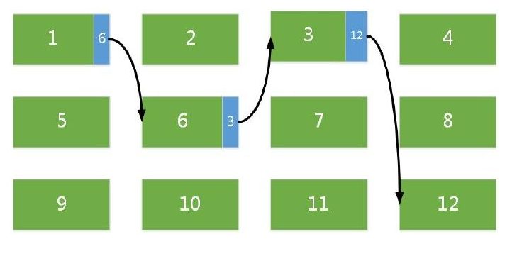

9. 在往 FAT 文件系统中存入一个文件时，系统会尽量存放在靠近磁盘开始的地方。当你存入第二个文件时，它会紧挨着第一个文件。当进行频繁的删除修改后，block 就会分散的特别厉害。FAT 文件系统没有 inode 的存在，所以不能一下子将文件的所有 block 在一开始就读取出来。每个 block 号码都记录在前一个 block 当中，形成一个 block 链。当我们需要读取文件的时候，就必须一个一个地将 block 读出，例如上图的读出顺序为 1、6、3、12 。这就会导致磁头无法在磁盘转一圈就获得所有数据，有时候需要来回转好几圈才能读取到这个文件，导致文件读取性能极差。这就是 Windows 经常需要碎片整理的原因——使离散的数据汇合在一起。
10. FAT不区分大小写，全都作为大写对待
11. NASM中单引号和双引号作用相同，**'\0'**需要自行添加
12. Loader任重道远，需要完成硬件检测、CPU模式转换、传递数据给内核
13. 硬件检测主要是通过BIOS中断获取硬件信息
14. 处理器模式转换即从实模式转换为保护模式
15. BIOS在实模式下只支持1MB内存空间寻址，必须先将部分程序读到临时空间后再转存到高于1MB地址空间去。
16. 0磁头0柱面1扇区，来个图形象一点。书上说道0磁头，0磁道，1扇区。磁道跟柱面其实一样，柱面立体感更强。

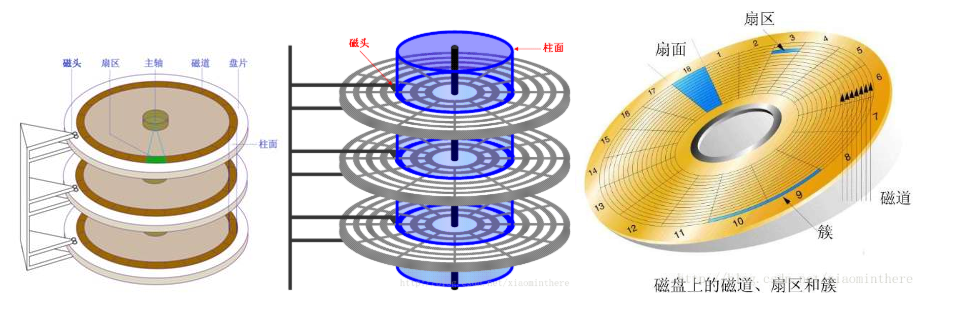


## 3-1代码实验-虚拟机启动

> 路径:code\chapter03\3-1

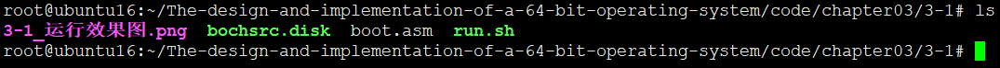

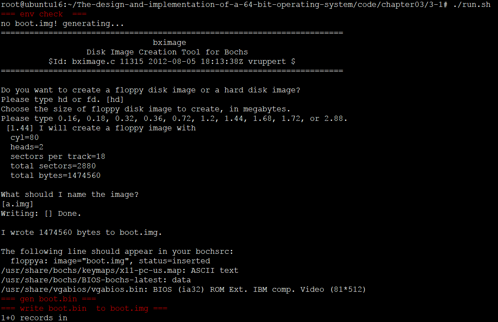

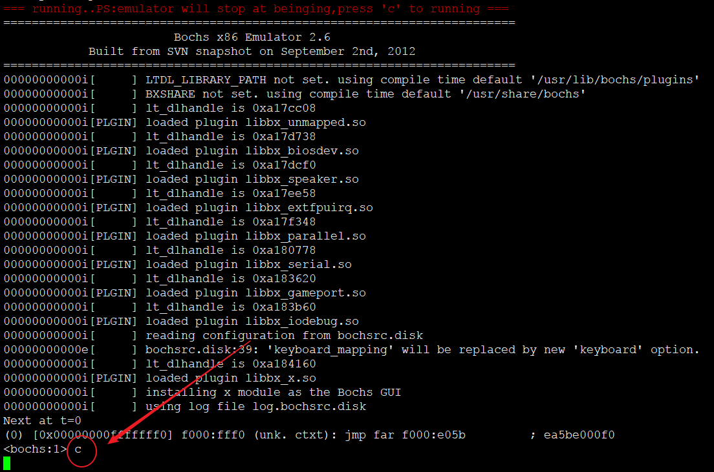

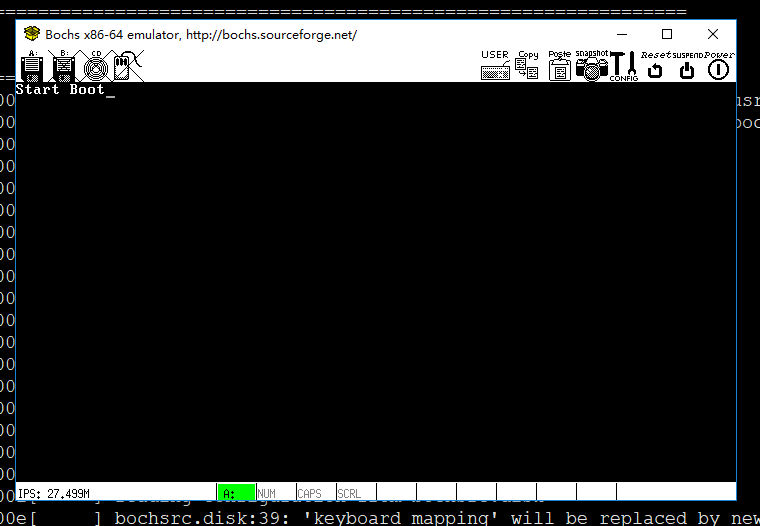

### 相关代码

```
	org	0x7c00

BaseOfStack	equ	0x7c00

Label_Start:

	mov	ax,	cs
	mov	ds,	ax
	mov	es,	ax
	mov	ss,	ax
	mov	sp,	BaseOfStack

;=======	clear screen

	mov	ax,	0600h
	mov	bx,	0700h
	mov	cx,	0
	mov	dx,	0184fh
	int	10h

;=======	set focus

	mov	ax,	0200h
	mov	bx,	0000h
	mov	dx,	0000h
	int	10h

;=======	display on screen : Start Booting......

	mov	ax,	1301h
	mov	bx,	000fh
	mov	dx,	0000h
	mov	cx,	10
	push	ax
	mov	ax,	ds
	mov	es,	ax
	pop	ax
	mov	bp,	StartBootMessage
	int	10h

;=======	reset floppy

	xor	ah,	ah
	xor	dl,	dl
	int	13h

	jmp	$

StartBootMessage:	db	"Start Boot"

;=======	fill zero until whole sector

	times	510 - ($ - $$)	db	0
	dw	0xaa55


```

### 功能描述

第一行代码，功能很简单，调用BIOS中断，在屏幕显示字符串

## 3-2代码-建立FAT分区加载Loader

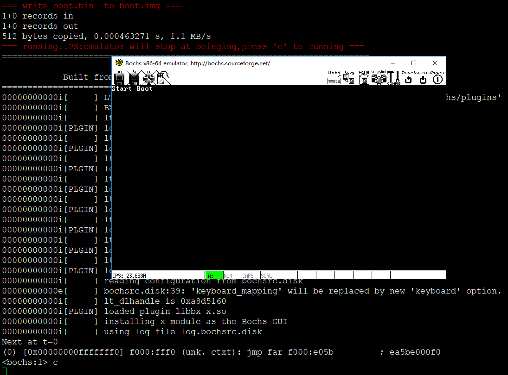

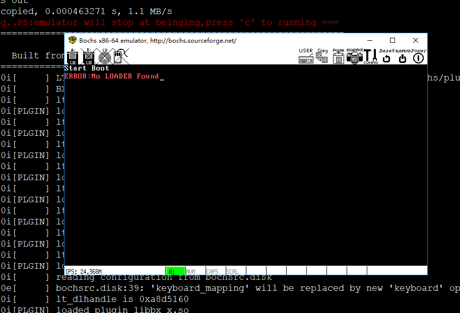

### 功能描述

尝试加载Loader


## 3-3代码-FAT分区中加载Loader

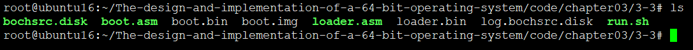

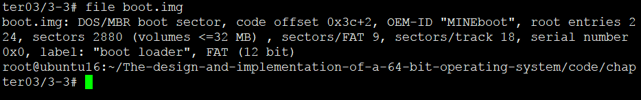

			当把boot.img写入到boot.img中时，该镜像即支持FAT12文件系统
			这里conv一定要加，不然会截断文件，本来1.5MB变成512B
			dd if=boot.bin of=boot.img bs=512 count=1 conv=notrunc

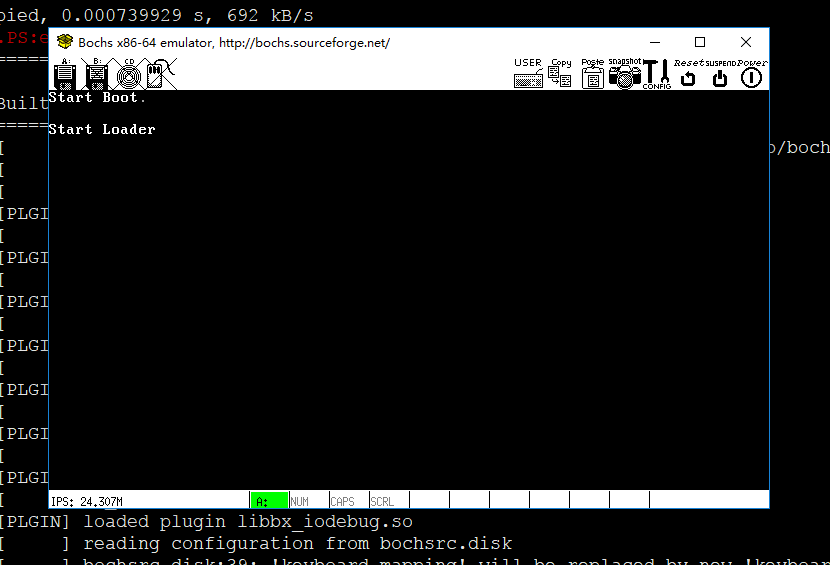

### 功能描述

从FAT分区加载loader，并且跳转执行

## 3-4

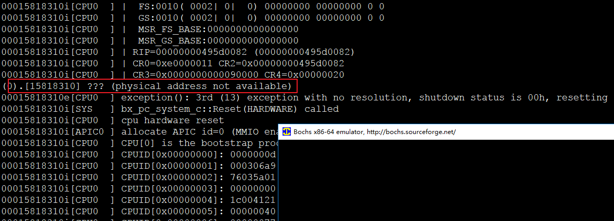

不解为何报错，并没有像书上65页所示。作者也没说明。。探索中。。。作者惜字如金，还得让读者猜一猜~~因缺思厅
