<!-- TOC depthFrom:1 depthTo:6 withLinks:1 updateOnSave:1 orderedList:0 -->

- [第4章-内核层](#第4章-内核层)
	- [4-1代码实验-内核头程序](#4-1代码实验-内核头程序)
		- [相关代码](#相关代码)
		- [功能描述](#功能描述)
	- [4-2代码实验-屏幕上显示色彩](#4-2代码实验-屏幕上显示色彩)
		- [相关代码](#相关代码)
		- [功能描述](#功能描述)
	- [4-3代码实验-屏幕上格式化字符串](#4-3代码实验-屏幕上格式化字符串)
		- [相关代码](#相关代码)
		- [功能描述](#功能描述)
	- [4-4代码实验-异常中断日志显示](#4-4代码实验-异常中断日志显示)
		- [相关代码](#相关代码)
		- [功能描述](#功能描述)
	- [4-5代码实验-高级异常中断日志显示](#4-5代码实验-高级异常中断日志显示)
		- [相关代码](#相关代码)
		- [功能描述](#功能描述)
	- [4-6代码实验-获取物理内存信息](#4-6代码实验-获取物理内存信息)
		- [相关代码](#相关代码)
		- [功能描述](#功能描述)
	- [4-7代码实验-计算可用物理内存页数](#4-7代码实验-计算可用物理内存页数)
		- [相关代码](#相关代码)
		- [功能描述](#功能描述)
	- [4-8代码实验-显示全局内存信息](#4-8代码实验-显示全局内存信息)
		- [相关代码](#相关代码)
		- [功能描述](#功能描述)
	- [4-9代码实验-触发中断](#4-9代码实验-触发中断)
		- [相关代码](#相关代码)
		- [功能描述](#功能描述)
	- [4-10代码实验-键盘中断捕获](#4-10代码实验-键盘中断捕获)
		- [相关代码](#相关代码)
		- [功能描述](#功能描述)
	- [4-11代码实验-运行init进程](#4-11代码实验-运行init进程)
		- [相关代码](#相关代码)
		- [功能描述](#功能描述)
	- [总结](#总结)

<!-- /TOC -->
# 第4章-内核层

## 4-1代码实验-内核头程序

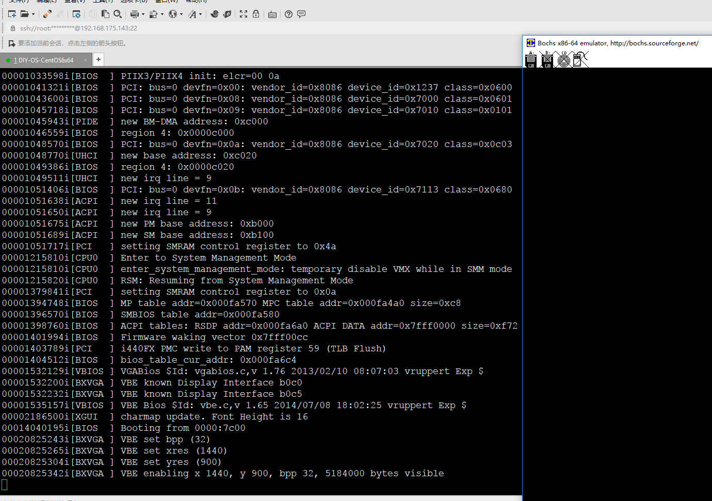

### 相关代码

### 功能描述

## 4-2代码实验-屏幕上显示色彩

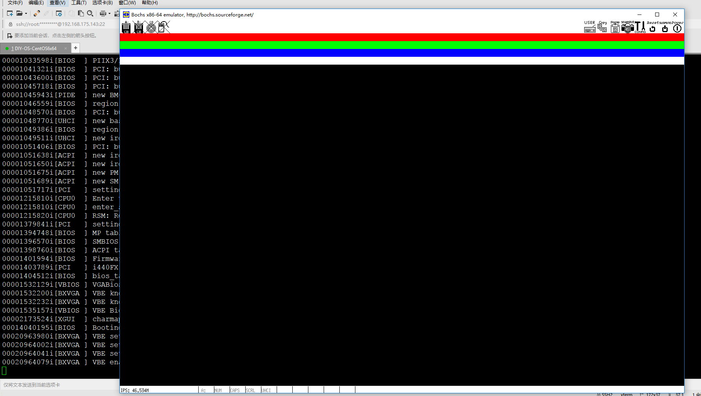

### 相关代码

### 功能描述

## 4-3代码实验-屏幕上格式化字符串

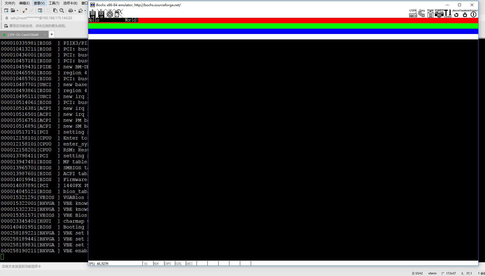

### 相关代码

### 功能描述

## 4-4代码实验-异常中断日志显示

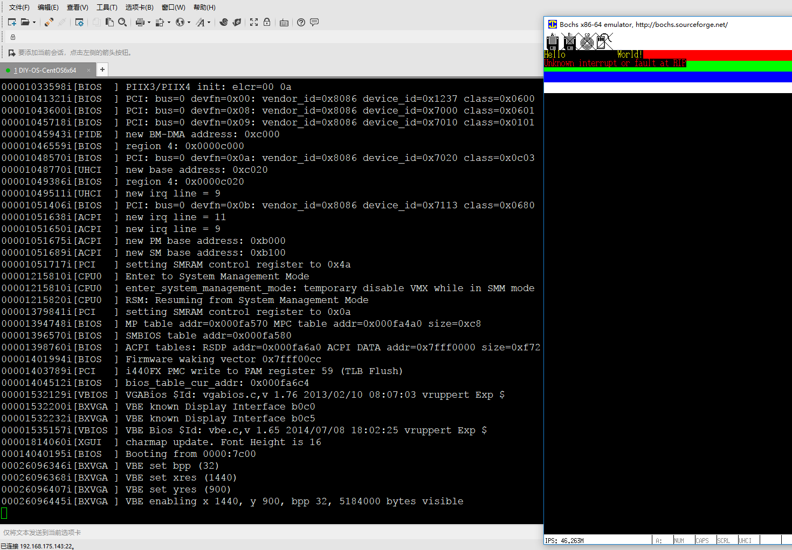

### 相关代码

### 功能描述

## 4-5代码实验-高级异常中断日志显示

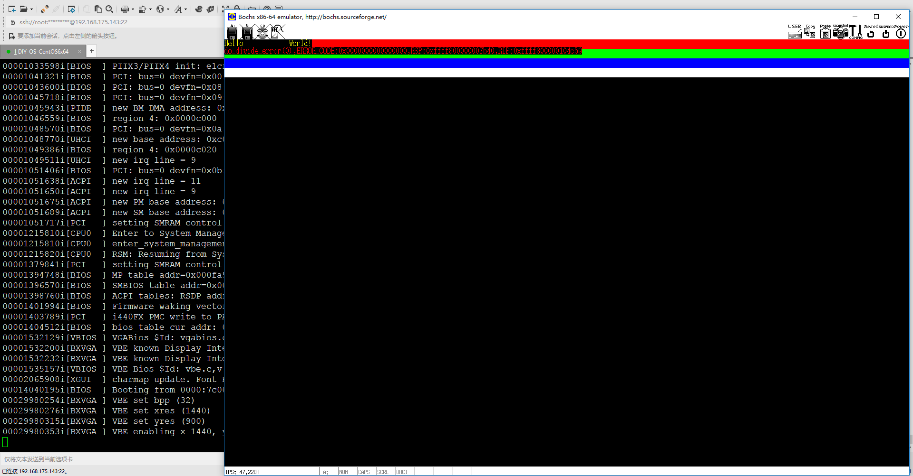

### 相关代码

### 功能描述

## 4-6代码实验-获取物理内存信息

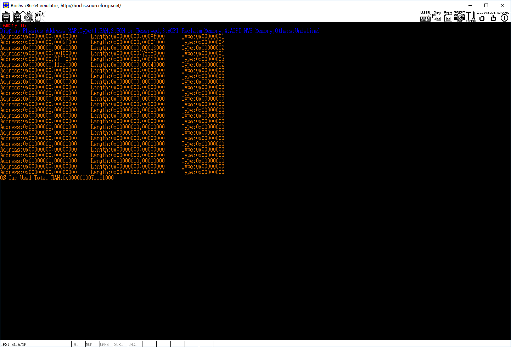

### 相关代码

### 功能描述

## 4-7代码实验-计算可用物理内存页数

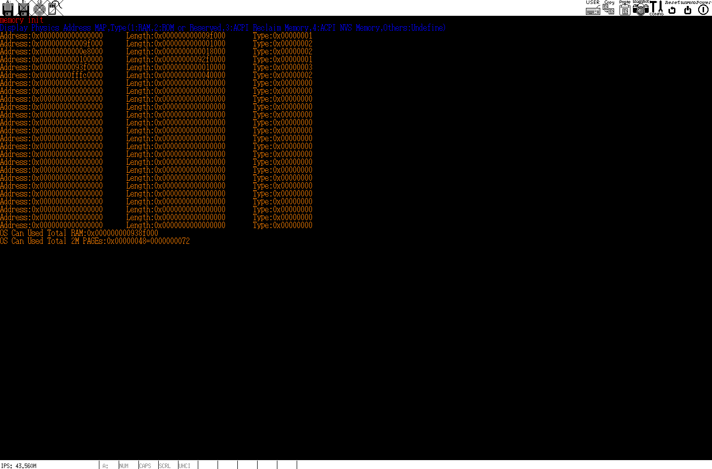

### 相关代码

### 功能描述

## 4-8代码实验-显示全局内存信息

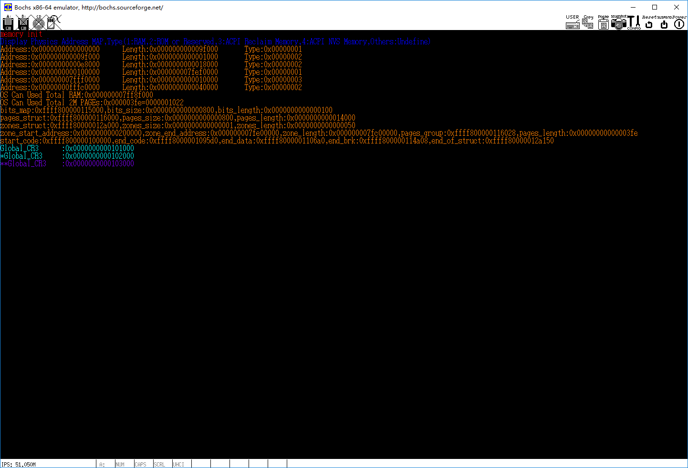

### 相关代码

### 功能描述

## 4-9代码实验-触发中断

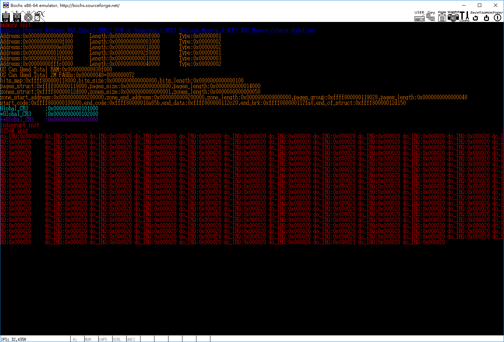

### 相关代码

### 功能描述

## 4-10代码实验-键盘中断捕获

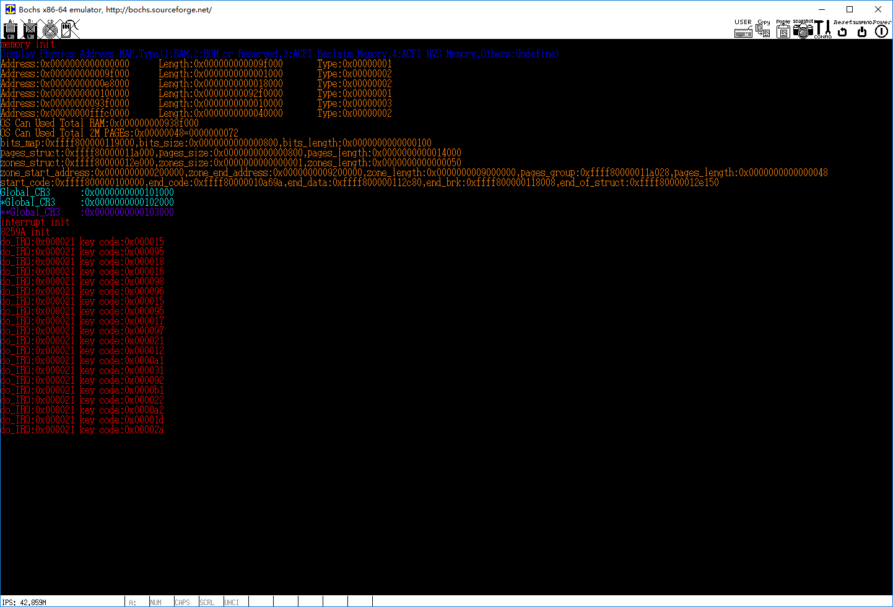

### 相关代码

### 功能描述

## 4-11代码实验-运行init进程

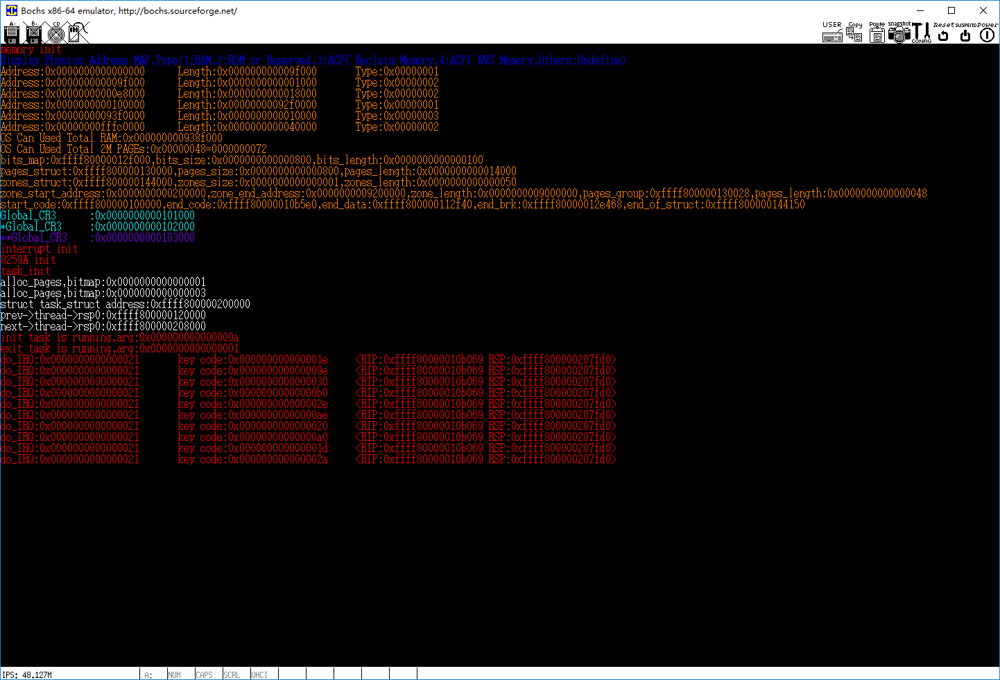

### 相关代码

### 功能描述

## 总结
