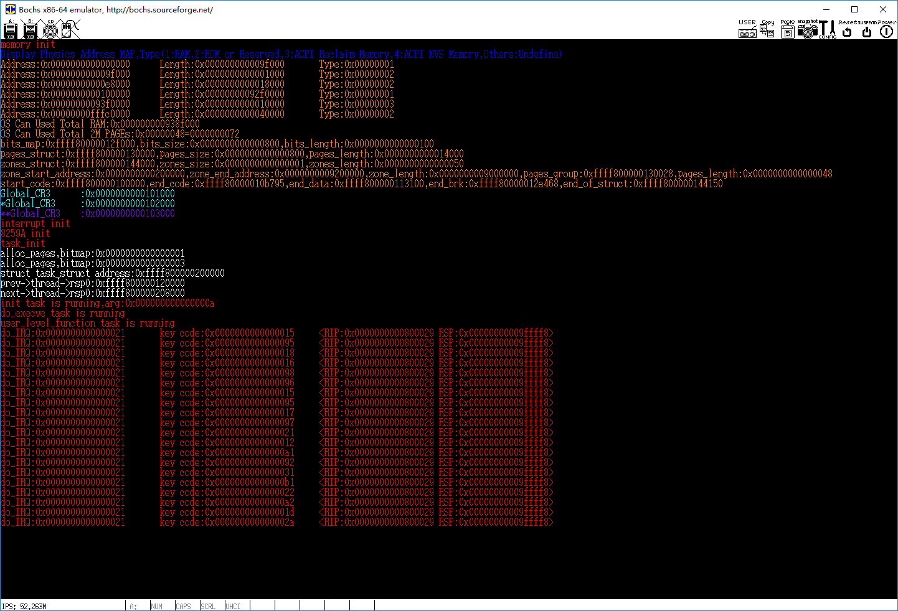
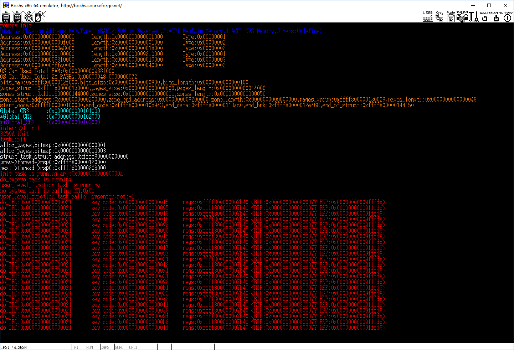
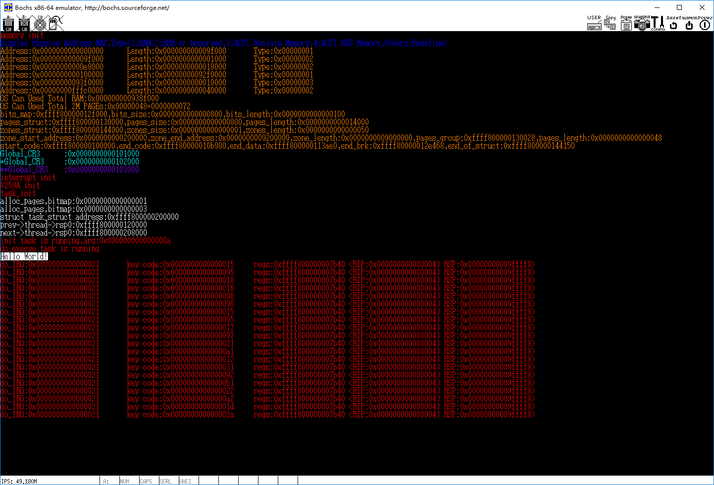

<!-- TOC depthFrom:1 depthTo:6 withLinks:1 updateOnSave:1 orderedList:0 -->

- [第5章-应用层](#第5章-应用层)
	- [5-1代码实验-应用层跳转程序](#5-1代码实验-应用层跳转程序)
		- [相关代码](#相关代码)
		- [功能描述](#功能描述)
	- [5-2代码实验-实现系统调用](#5-2代码实验-实现系统调用)
		- [相关代码](#相关代码)
		- [功能描述](#功能描述)
	- [5-3代码实验-系统调用处理函数实例](#5-3代码实验-系统调用处理函数实例)
		- [相关代码](#相关代码)
		- [功能描述](#功能描述)
	- [总结](#总结)

<!-- /TOC -->
# 第5章-应用层

## 5-1代码实验-应用层跳转程序

### 相关代码

### 功能描述

## 5-2代码实验-实现系统调用

### 相关代码

### 功能描述

## 5-3代码实验-系统调用处理函数实例

### 相关代码

### 功能描述

## 总结
