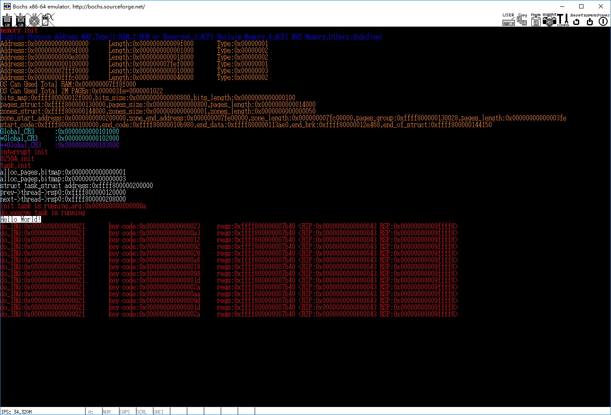

<!-- TOC depthFrom:1 depthTo:6 withLinks:1 updateOnSave:1 orderedList:0 -->

- [第6章-处理器体系结构](#第6章-处理器体系结构)
	- [6-1代码实验-体系结构相关](#6-1代码实验-体系结构相关)
		- [相关代码](#相关代码)
		- [功能描述](#功能描述)
	- [总结](#总结)

<!-- /TOC -->
# 第6章-处理器体系结构

## 6-1代码实验-体系结构相关

### 相关代码

### 功能描述

## 总结
